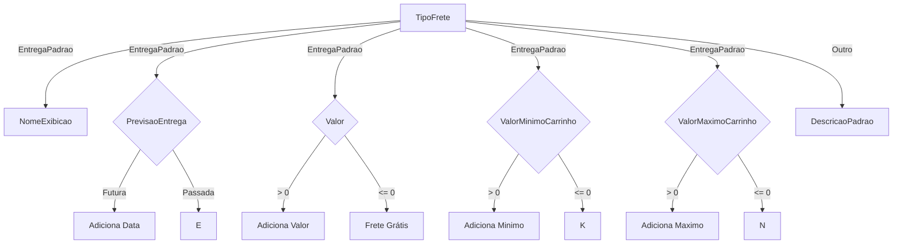

# Frete
**Namespace**: IsthmusWinthor.Dominio.POCO  
**Nome do Arquivo**: Frete.cs  

## Visão Geral e Responsabilidade
A classe `Frete` representa um modelo de domínio que gerencia as informações relacionadas ao cálculo e detalhamento do frete de transporte de mercadorias. Ela encapsula a lógica de formação da descrição do frete, regras de negócios para a determinação de valores mínimos e máximos do carrinho, além de integrar com uma transportadora. Essa classe é fundamental para a aplicação, pois garante que as informações do frete sejam apresentadas corretamente ao usuário e que as regras de entrega e custos sejam adequadamente aplicadas nas transações.

## Métodos de Negócio

### Título: `Descricao` (propriedade pública)
**Objetivo**: Garante a geração de uma descrição detalhada do frete, proporcionando ao usuário uma visão clara e formatada das condições do frete.

**Comportamento**:
1. Inicializa um `StringBuilder` para construir a descrição.
2. Avalia o tipo de frete (`TipoFrete`):
   - Para `EntregaPadrao` e `RetiradaLocal`:
     - Adiciona o nome de exibição do frete.
     - Se a `PrevisaoEntrega` for futura, adiciona a data prevista.
     - Se existir um valor para o frete, apresenta o valor; caso contrário, indica que o frete é grátis.
     - Adiciona informações sobre o valor mínimo e máximo do carrinho, caso definidos.
   - Para outros tipos de frete, chama o método `DescricaoPadrao` para obter uma descrição padrão.
3. Retorna a descrição construída.

**Retorno**: Uma string formatada que apresenta todos os detalhes relevantes sobre o frete, pronta para exibição ao usuário.

## Propriedades Calculadas e de Validação

### Título: `ValorMinimoCarrinho`
**Regra**: Retorna o valor mínimo que deve ser atingido no carrinho para que o frete possa ser aplicado. Ele é obtido a partir dos filtros associados ao frete. O cálculo leva em consideração apenas aqueles filtros que são do tipo `ValorCarrinhoMinimo` e que possuem valores válidos.

### Título: `ValorMaximoCarrinho`
**Regra**: Retorna o valor máximo que o carrinho pode ter para que o frete seja aplicável. Assim como o valor mínimo, ele é extraído dos filtros associados, considerando apenas aqueles que são do tipo `ValorCarrinhoMaximo`.

## Navigations Property
- Não há propriedades de navegação complexas do domínio nesta classe.

## Tipos Auxiliares e Dependências
- **Enums**:
  - `[TipoFrete](TipoFrete.md)`
  - `[TipoFiltroFrete](TipoFiltroFrete.md)`

- **Classes Estáticas/Helpers**:
  - `[DecimalUtil](Base.Utilidades.md)`: Utilizada para formatação do valor do frete.

## Diagrama de Relacionamentos

