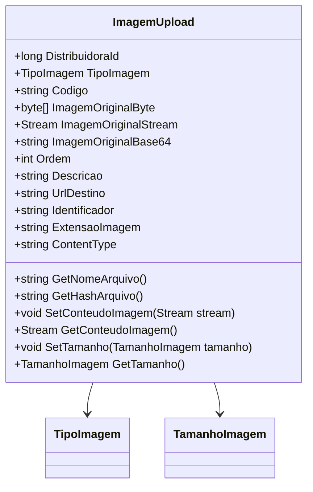

# ImagemUpload
**Namespace**: IsthmusWinthor.Dominio.POCO  
**Nome do Arquivo**: ImagemUpload.cs  

## Visão Geral e Responsabilidade
A classe `ImagemUpload` é responsável por gerenciar a manipulação de imagens de forma a garantir a integridade e a correta formatação dos dados associados a imagens que são enviadas ou processadas. Ela resolve o problema de como armazenar, converter e gerar informações relevantes sobre imagens, como nome do arquivo e hash, assegurando que as imagens estejam sempre em um estado adequado para os processos do sistema.

## Métodos de Negócio

### Método: GetNomeArquivo()
- **Visibilidade**: Público
- **Objetivo**: Garante que o nome do arquivo gerado tenha um formato consistente com base nos metadados da imagem, incluindo a ID da distribuidora, tipo da imagem, código, tamanho e tipo de extensão.
- **Comportamento**: O método constrói o nome do arquivo concatenando a `DistribuidoraId`, `TipoImagem`, `Codigo`, `GetTamanho()` e um GUID exclusivo, seguido pela extensão da imagem. 
- **Retorno**: Retorna uma string que representa o nome completo do arquivo a ser salvo.

### Método: GetHashArquivo()
- **Visibilidade**: Público
- **Objetivo**: Garante uma representação única da imagem através de seu hash, útil para verificar a integridade e a singularidade do arquivo.
- **Comportamento**: O método utiliza o algoritmo SHA-1 para calcular o hash da imagem original em bytes. Ele codifica esse hash em Base64 e aplica URL encoding para assegurar que o valor resultante é seguro para uso em URLs.
- **Retorno**: Retorna uma string representando o hash codificado da imagem.

### Método: SetConteudoImagem(Stream stream)
- **Visibilidade**: Público
- **Objetivo**: Armazena o conteúdo de uma imagem a partir de um fluxo de dados.
- **Comportamento**: O método simplesmente atribui o fluxo recebido à propriedade interna `conteudoImagemUpload`.
- **Retorno**: Não possui retorno.

### Método: GetConteudoImagem()
- **Visibilidade**: Público
- **Objetivo**: Retorna o conteúdo da imagem armazenado.
- **Comportamento**: O método retorna o valor do fluxo interno `conteudoImagemUpload`.
- **Retorno**: Retorna um objeto do tipo `Stream` que contém o conteúdo da imagem.

### Método: StreamToArray(Stream stream)
- **Visibilidade**: Privado
- **Objetivo**: Converte um fluxo de dado de imagem em um array de bytes.
- **Comportamento**: O método verifica se o fluxo é nulo ou vazio. Se válido, o método copia o fluxo para um novo `MemoryStream` e converte seu conteúdo em um array de bytes.
- **Retorno**: Retorna um array de bytes que representa os dados da imagem ou nulo em caso de falha.

### Método: Base64ToArray(string stringBase64)
- **Visibilidade**: Privado
- **Objetivo**: Converte uma string codificada em Base64 para um array de bytes.
- **Comportamento**: O método tenta converter a string fornecida em um array de bytes. Em caso de falha, retorna nulo.
- **Retorno**: Retorna um array de bytes ou nulo se a conversão falhar.

## Propriedades Calculadas e de Validação

### Propriedade: ExtensaoImagem
- **Regra**: Se a extensão da imagem não for definida, assume-se que a extensão padrão é "png". Durante a definição, se a string estiver vazia, também será definida como "png".

### Propriedade: ContentType
- **Regra**: A propriedade retorna o tipo de conteúdo correspondente à extensão da imagem, utilizando um helper que determina o `ContentType` com base no valor de `ExtensaoImagem`.

## Navegação Properties
- `TipoImagem`: [TipoImagem](TipoImagem.md)
- `TamanhoImagem`: [TamanhoImagem](TamanhoImagem.md)

## Tipos Auxiliares e Dependências
- Enum: [TipoImagem](TipoImagem.md)
- Enum: [TamanhoImagem](TamanhoImagem.md)
- Classe Helper: [ContentTypeHelper](ContentTypeHelper.md)

## Diagrama de Relacionamentos

---
Gerada em 29/12/2025 21:35:12
