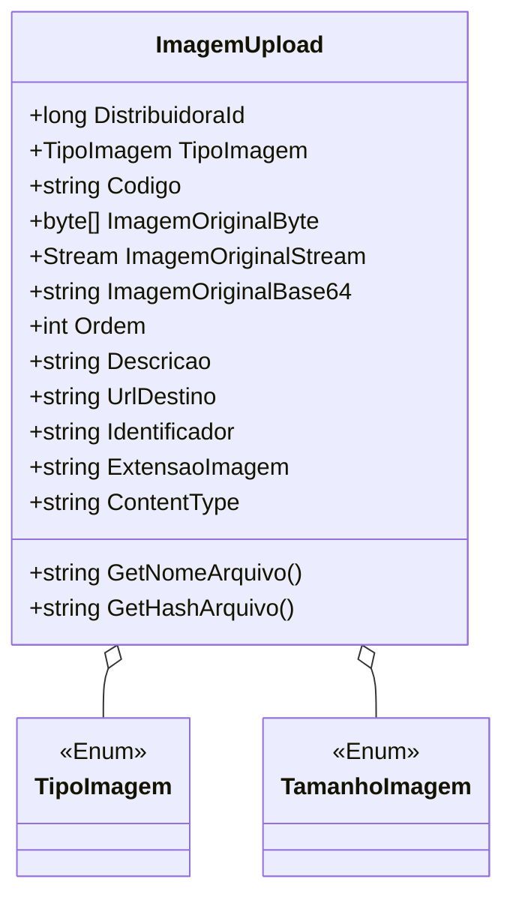

# ImagemUpload
**Namespace**: IsthmusWinthor.Dominio.POCO  
**Nome do Arquivo**: ImagemUpload.cs  

## Visão Geral e Responsabilidade
A classe `ImagemUpload` atua como um modelo para gerenciar imagens carregadas, suas propriedades e suas representações em diferentes formatos. Ela resolve o problema de manipulação e armazenamento de arquivos de imagem provenientes de diversas fontes, garantindo que as imagens sejam convertidas, acessadas e identificadas adequadamente mediante suas características.

## Métodos de Negócio

### Título: `GetNomeArquivo` - `public`
- **Objetivo**: Garante que o nome do arquivo gerado seja único e siga a formatação necessária para identificação.
- **Comportamento**: 
  1. Combina as propriedades `DistribuidoraId`, `TipoImagem`, `Codigo`, a representação em caixa baixa de `TamanhoImagem` e um GUID para criar um nome de arquivo.
  2. Usa a extensão da imagem para finalizar o nome do arquivo.
- **Retorno**: Retorna uma string que representa o nome do arquivo formatado.

### Título: `GetHashArquivo` - `public`
- **Objetivo**: Garante a integridade da imagem gerando um hash que pode ser utilizado na verificação de dados.
- **Comportamento**: 
  1. Cria um objeto `SHA1CryptoServiceProvider` para calcular um hash da imagem armazenada em `ImagemOriginalByte`.
  2. Retorna uma string codificada em Base64 que representa o hash da imagem.
- **Retorno**: Retorna uma string que é o hash da imagem, codificado para URL.

### Título: `StreamToArray` - `private`
- **Objetivo**: Conversão de um `Stream` para um array de bytes.
- **Comportamento**:
  1. Verifica se o stream não é nulo e tem conteúdo. 
  2. Cria um `MemoryStream` e copia o conteúdo do stream original.
  3. Retorna um array de bytes representando o conteúdo do stream.
- **Retorno**: Retorna um array de bytes ou nulo se o stream estiver vazio ou inválido.

### Título: `Base64ToArray` - `private`
- **Objetivo**: Converter uma string Base64 para um array de bytes.
- **Comportamento**: 
  1. Verifica se a string Base64 não é nula ou vazia.
  2. Tenta converter a string usando `Convert.FromBase64String`.
  3. Retorna um array de bytes ou nulo em caso de erro.
- **Retorno**: Retorna o array de bytes gerado ou nulo se a conversão falhar.

## Propriedades Calculadas e de Validação

### `ExtensaoImagem`
- **Regra**: Retorna "png" como valor padrão se nenhum valor tiver sido atribuído. Pode ser validada e definida com base em uma extensão de arquivo fornecida.

### `ContentType`
- **Regra**: Retorna o tipo de conteúdo correspondente à extensão da imagem usando um helper de conteúdo. A extensão é validada quando definida.

## Navigation Properties
- Nenhuma propriedade de navegação complexa mapeada.

## Tipos Auxiliares e Dependências
- Enum: `[TipoImagem](TipoImagem.md)`
- Enum: `[TamanhoImagem](TamanhoImagem.md)`
- Classe Helper: `[ContentTypeHelper](ContentTypeHelper.md)`

## Diagrama de Relacionamentos

Essa estrutura documenta as principais regras de negócio da classe `ImagemUpload`, além de suas propriedades e a interconexão com enums relevantes, seguindo rigorosamente as diretrizes apresentadas.
