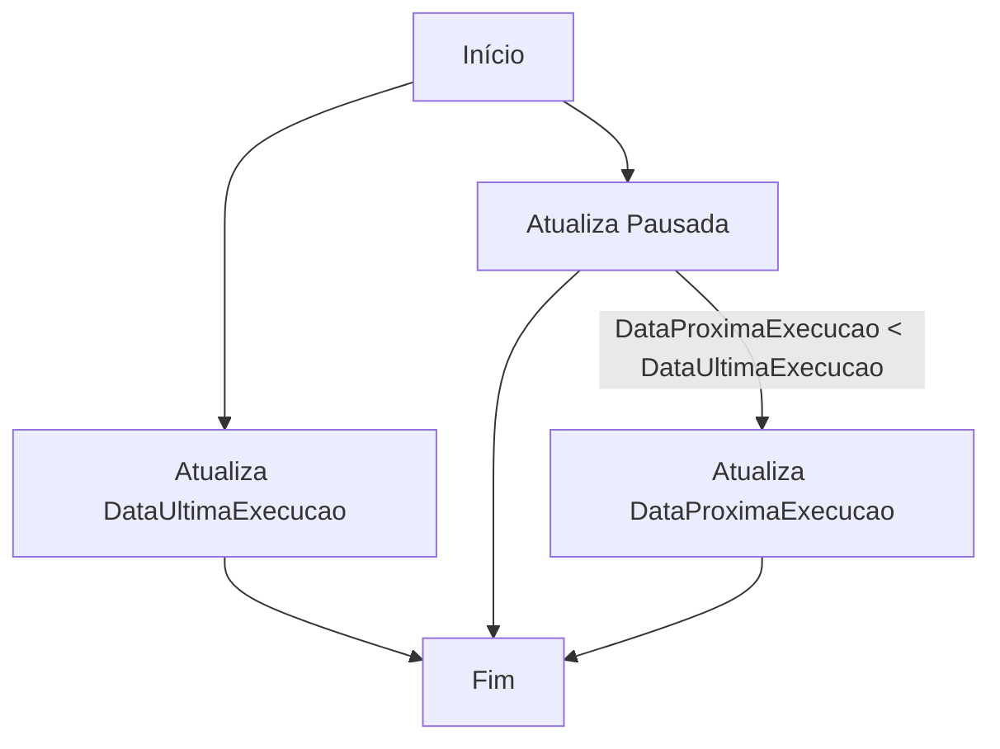
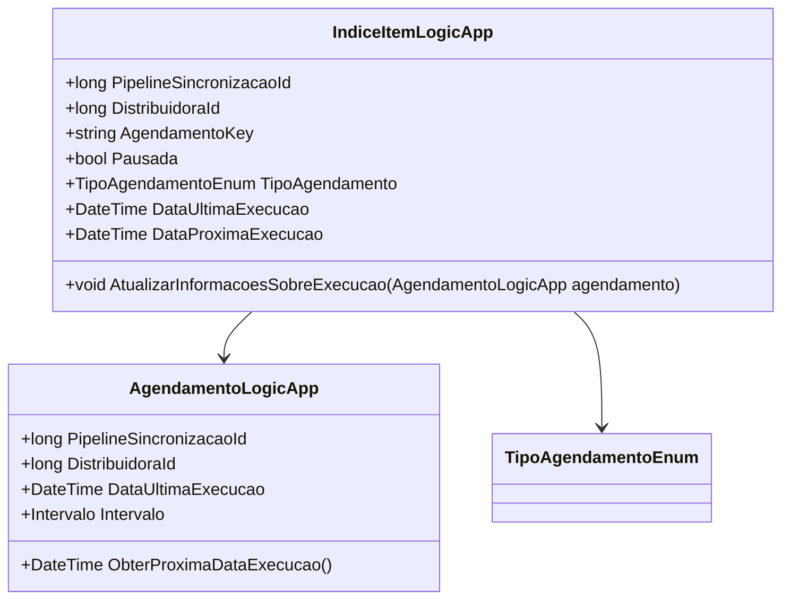

# IndiceItemLogicApp
**Namespace**: IsthmusWinthor.Dominio.POCO  
**Nome do Arquivo**: IndiceItemLogicApp.cs  

## Visão Geral e Responsabilidade
A classe `IndiceItemLogicApp` atua como um modelo de domínio que encapsula as informações acerca do agendamento de execuções vinculadas a um pipeline de sincronização e uma distribuidora. Sua principal responsabilidade é garantir a integridade entre os dados do agendamento e a lógica necessária para o seu controle, como a atualização das datas de execução e o estado de pausa, resolvendo problemas relacionados à programação e execução de tarefas em uma aplicação corporativa.

## Métodos de Negócio

### AtualizarInformacoesSobreExecucao (public)
- **Objetivo**: Garantir que as informações sobre a última execução e o estado de pausa sejam atualizadas corretamente com base no agendamento atual.
- **Comportamento**:
    1. Atualiza a propriedade `DataUltimaExecucao` com o valor da propriedade correspondente do objeto `agendamento` passado como argumento.
    2. Atualiza a propriedade `Pausada` com o estado atual do intervalo do agendamento.
    3. Verifica se a `DataProximaExecucao` é anterior à `DataUltimaExecucao` do agendamento.
    4. Se a condição anterior for verdadeira, atribui à `DataProximaExecucao` o valor retornado pelo método `ObterProximaDataExecucao()` do agendamento.
- **Retorno**: Não possui retorno; o método altera o estado do objeto.

## Propriedades Calculadas e de Validação
As propriedades da classe não contém lógica de cálculo em seus `getters` ou validação nos `setters`. Elas são definidas diretamente através do construtor e atualizadas por métodos específicos.

## Navigations Property
- Não há propriedades que sejam classes complexas do domínio nesta classe.

## Tipos Auxiliares e Dependências
- Utiliza o enumerador [TipoAgendamentoEnum](TipoAgendamentoEnum.md) para determinar o tipo de agendamento.
- Dependência em `AgendamentoLogicApp`, que é uma outra classe do domínio a ser definida.

## Diagrama de Relacionamentos

---
Gerada em 29/12/2025 21:35:28
