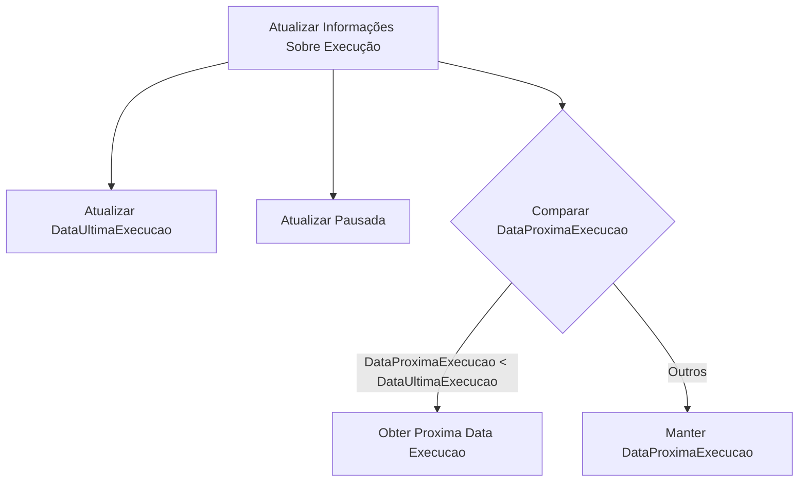
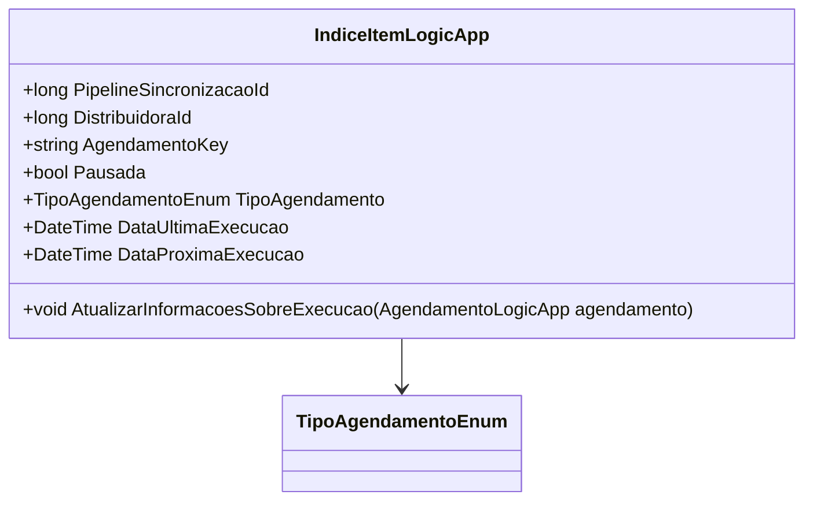

# IndiceItemLogicApp
**Namespace**: IsthmusWinthor.Dominio.POCO  
**Nome do Arquivo**: IndiceItemLogicApp.cs  

## Visão Geral e Responsabilidade
A classe `IndiceItemLogicApp` é responsável por gerenciar e armazenar informações sobre a execução de agendamentos de tarefas dentro de um sistema de sincronização. Ela fornece uma estrutura para manter e atualizar os dados relevantes sobre a execução de um pipeline de sincronização, permitindo que o sistema rastreie quando uma tarefa foi executada pela última vez, quando será executada novamente, se está pausada e o tipo de agendamento associado. Essa funcionalidade é crítica para garantir que as operações de sincronização aconteçam no tempo apropriado e de forma eficiente.

## Métodos de Negócio

### AtualizarInformacoesSobreExecucao (public)
- **Objetivo**: Garante que os dados sobre a execução do agendamento estão atualizados, refletindo a última execução e ajustando a próxima execução se necessário.
- **Comportamento**:
  1. Atualiza `DataUltimaExecucao` com a data da última execução do agendamento passado como parâmetro.
  2. Atualiza a propriedade `Pausada` de acordo com o estado atual do agendamento passado como parâmetro.
  3. Compara a `DataProximaExecucao` com a nova `DataUltimaExecucao`. Se a próxima data de execução for anterior à última execução, chama o método `ObterProximaDataExecucao` do agendamento para definir uma nova data.
- **Retorno**: Este método não tem retorno, mas afeta o estado interno da instância da classe.

## Propriedades Calculadas e de Validação
- As propriedades da classe não possuem lógica de cálculo ou validação, sendo utilizadas como meros armazenadores de dados.

## Navigations Property
- Não há propriedades que são classes complexas do domínio nesta classe.

## Tipos Auxiliares e Dependências
- Enum: `[TipoAgendamentoEnum](TipoAgendamentoEnum.md)`.

## Diagrama de Relacionamentos

