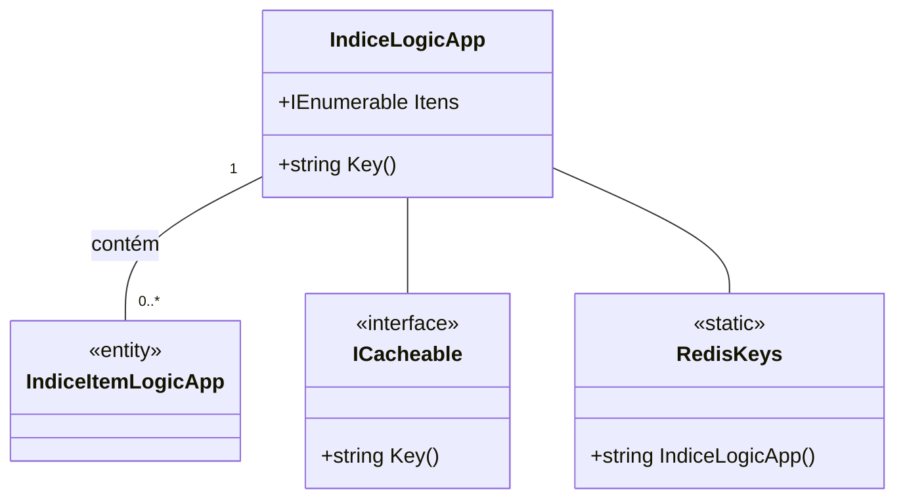

# IndiceLogicApp
- **Namespace**: IsthmusWinthor.Dominio.POCO
- **Nome do Arquivo**: IndiceLogicApp.cs

## Visão Geral e Responsabilidade
A classe `IndiceLogicApp` atua como um agregador para uma coleção de itens do tipo `IndiceItemLogicApp`. Sua responsabilidade principal é fornecer uma interface para acesso a esta coleção, além de implementar a funcionalidade de cache através da interface `ICacheable`. Este design promove a eficiência no acesso e gerenciamento dos itens de índice em um contexto de aplicação lógica.

## Métodos de Negócio

### Título: Key() - Público
- **Objetivo**: Este método gera e retorna uma chave única para o cache de instâncias de `IndiceLogicApp`. Ele garante que cada instância possa ser identificada de forma consistente no sistema de cache.
- **Comportamento**: 
  1. O método chama a função `RedisKeys.IndiceLogicApp()` que gera uma chave referencial para armazenar e recuperar esta coleção de itens em um cache Redis.
- **Retorno**: Retorna uma string que representa a chave única do cache para essa instância de `IndiceLogicApp`.

## Propriedades Calculadas e de Validação
Não há propriedades calculadas ou de validação que contenham lógica de cálculo no `get` ou validação no `set`.

## Navigations Property
- `Itens`: Propriedade que contém uma coleção de classes complexas do domínio:
  - [IndiceItemLogicApp](IndiceItemLogicApp.md)

## Tipos Auxiliares e Dependências
- Interface: [ICacheable](ICacheable.md)
- Classe: [RedisKeys](RedisKeys.md)

## Diagrama de Relacionamentos

---
Gerada em 29/12/2025 21:35:42
