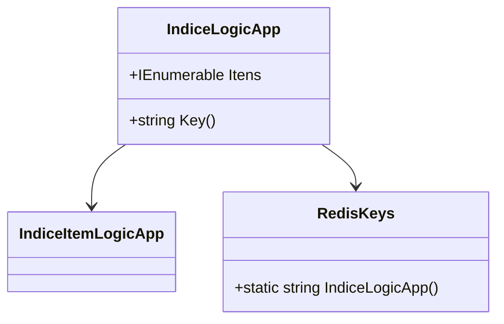

# IndiceLogicApp
**Namespace**: IsthmusWinthor.Dominio.POCO  
**Nome do Arquivo**: IndiceLogicApp.cs  

## Visão Geral e Responsabilidade
A classe `IndiceLogicApp` atua como um modelo de domínio que encapsula uma coleção de itens do tipo `IndiceItemLogicApp`, oferecendo uma estrutura para agrupamento e manipulação dessas entidades, garantindo assim a integridade e a coesão dos dados. Ela é responsável por gerenciar o acesso aos itens e fornecer uma chave única para cache através de seu método `Key()`, fundamental para o armazenamento eficiente em sistemas baseados em cache, como Redis. Essa funcionalidade é essencial para otimizar a performance da aplicação que consome estes dados.

## Métodos de Negócio

### Método: `Key()` (public)
- **Objetivo**: Garante a geração de uma chave única para a instância da classe, que pode ser utilizada para armazenamento em cache.
- **Comportamento**: O método invoca a função `RedisKeys.IndiceLogicApp()` para obter a chave específica do índice. Esta chave é utilizada para identificar de forma única o conjunto de dados representado por esta instância no cache, o que é crítico em operações que exigem alta performance.
- **Retorno**: Retorna uma string que representa a chave de cache para a instância do `IndiceLogicApp`.

## Propriedades Calculadas e de Validação
- Não existem propriedades com lógica complexa no `get` ou validação no `set` nesta classe.

## Navigation Property
- `Itens`: Este é um conjunto de itens do tipo `[IndiceItemLogicApp](IndiceItemLogicApp.md)`, representando os elementos que compõem o índice. 

## Tipos Auxiliares e Dependências
- `IndiceItemLogicApp`: [IndiceItemLogicApp](IndiceItemLogicApp.md)
- `RedisKeys`: Classe que fornece métodos para geração de chaves para cache.

## Diagrama de Relacionamentos

