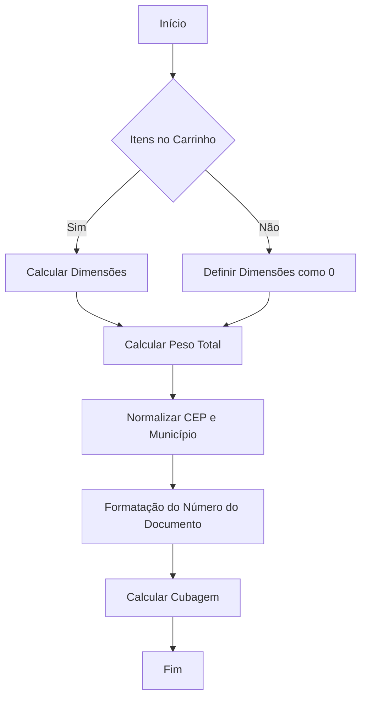
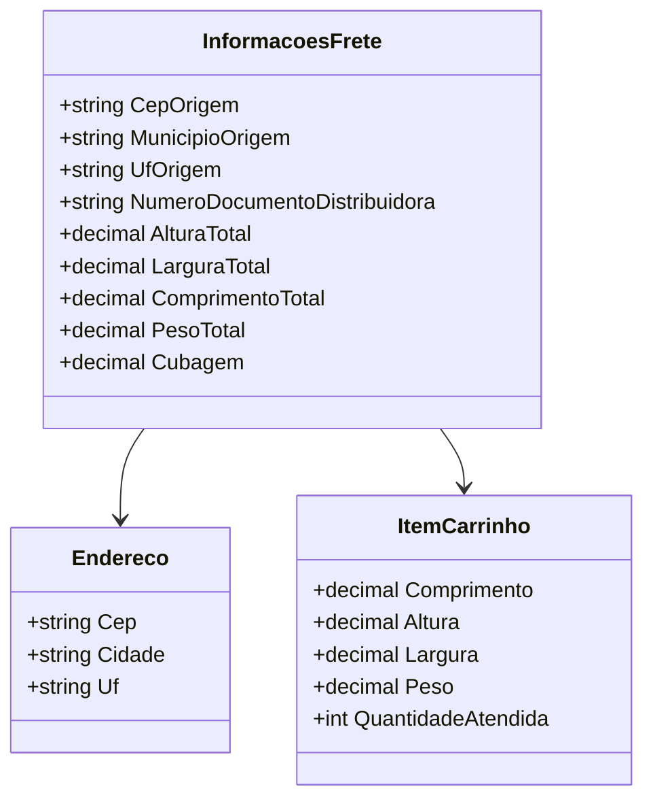

# InformacoesFrete
**Namespace**: IsthmusWinthor.Dominio.POCO  
**Nome do Arquivo**: InformacoesFrete.cs

## Visão Geral e Responsabilidade
A classe `InformacoesFrete` é responsável por calcular e armazenar informações logísticas relacionadas ao frete de um conjunto de itens em um carrinho de compras. Ela aborda a necessidade de determinar parâmetros essenciais como dimensões totais, peso e cubagem com base nos itens do carrinho e no endereço de origem. Essa classe é crucial para otimizar o cálculo de custos de transporte e assegurar que os dados de frete estejam corretos antes do envio.

## Métodos de Negócio

### Título: `InformacoesFrete` (Construtor)
- **Objetivo**: Garante a inicialização corretas das informações de frete, calculando dimensões e pesos dos itens.
- **Comportamento**:
  1. Recebe uma lista de itens no carrinho, endereço e número do documento da distribuidora.
  2. Inicializa as dimensões totais (comprimento, altura, largura) e a quantidade atendida de itens como zero.
  3. Caso existam itens, calcula:
     - O comprimento máximo dos itens.
     - A altura máxima dos itens.
     - A largura máxima dos itens.
     - A quantidade total atendida pelos itens.
  4. Normaliza o CEP e a cidade, armazenando-os nas propriedades correspondentes.
  5. Formata e armazena o número do documento da distribuidora.
  6. Calcula o peso total, somando o peso de cada item, considerando um adicional de 0.300 kg por item.
  7. Chama o método `CalcularCubagem` com as dimensões e a quantidade total para calcular a cubagem total dos itens.
- **Retorno**: Não retorna um valor; inicializa a instância da classe.

### Título: `CalcularCubagem` (Privado)
- **Objetivo**: Calcula a cubagem total com base nas dimensões dos itens e na quantidade total.
- **Comportamento**:
  1. Recebe altura, comprimento, largura e quantidade total de itens como parâmetros.
  2. Converte as dimensões para metros (dividindo por 100).
  3. Calcula a cubagem multiplicando altura, comprimento e largura.
  4. Multiplica o volume obtido pela quantidade total de itens para obter a cubagem total.
  5. Retorna o valor da cubagem calculada.
- **Retorno**: `decimal` - representando a cubagem total calculada.

## Propriedades Calculadas e de Validação
- `Cubagem`: Calculada com base na altura, comprimento, largura e a quantidade total de itens. A fórmula utilizada considera as dimensões em metros e multiplica pelo total de itens.
- `PesoTotal`: A propriedade resulta da soma dos pesos dos itens, com um incremento adicional para cada um.

## Navigations Property
- `Endereco`: Referência à classe `Endereco` que contém detalhes do endereço (presumidamente em outro arquivo [Endereco](Endereco.md)).
- `ItemCarrinho`: Referência à classe `ItemCarrinho` que representa os itens do carrinho (presumidamente em outro arquivo [ItemCarrinho](ItemCarrinho.md)).

## Tipos Auxiliares e Dependências
- `NormalizadorUtil`: Utilizado para normalizar a cidade.
- Não possui enumeradores ou classes auxiliares adicionais que sejam relevantes neste contexto.

## Diagrama de Relacionamentos

Este documento fornece uma visão clara sobre a classe `InformacoesFrete`, suas responsabilidades no domínio, as regras de negócio que implementa, bem como a estrutura e interações com outras entidades no sistema.
