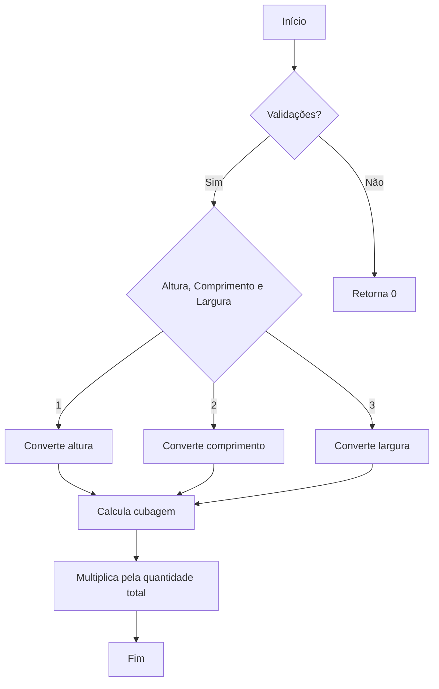
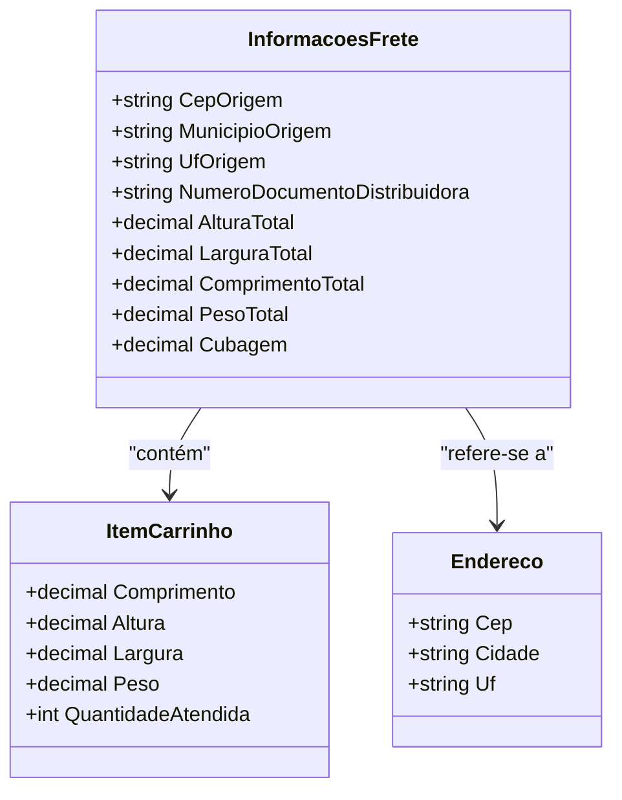

# InformacoesFrete
**Namespace**: IsthmusWinthor.Dominio.POCO  
**Nome do Arquivo**: InformacoesFrete.cs

## Visão Geral e Responsabilidade
A classe `InformacoesFrete` é responsável por calcular e armazenar informações cruciais sobre o frete de produtos com base nos itens do carrinho e no endereço de origem. Ela integra dados sobre dimensões, peso e cubagem para determinar condições necessárias para o transporte e entrega, essencial para a logística e operações de distribuição.

## Métodos de Negócio

### Título: `CalcularCubagem` (private)
- **Objetivo**: Garante o cálculo correto da cubagem, que é um fator determinante no custo e viabilidade do transporte de mercadorias.
- **Comportamento**: 
  1. Recebe altura, comprimento e largura, além da quantidade total de itens.
  2. Converte as medidas de centímetros para metros, dividindo cada dimensão por 100.
  3. Multiplica altura, comprimento e largura para calcular a cubagem de um único item.
  4. Multiplica a cubagem do item pela quantidade total para obter a cubagem total.
- **Retorno**: Retorna um valor decimal correspondente ao volume total ocupado pelos itens, em metros cúbicos.

## Propriedades Calculadas e de Validação
- **Cubagem**: Calcula a cubagem total dos itens com base em suas dimensões e quantidade. A regra é que a cubagem é calculada após a conversão das medidas de centímetros para metros, multiplicando a altura, comprimento e largura.

## Navigations Property
- **Endereco**: Representa o endereço de origem do frete. [Endereco](Endereco.md)

## Tipos Auxiliares e Dependências
- **NormalizadorUtil**: Classe utilizada para normalização de strings, especificamente no tratamento do nome da cidade. [NormalizadorUtil](NormalizadorUtil.md)
- **ItemCarrinho**: Representa os itens no carrinho de compras, sendo utilizado para calcular peso e dimensões. [ItemCarrinho](ItemCarrinho.md)

## Diagrama de Relacionamentos

---
Gerada em 29/12/2025 21:36:01
