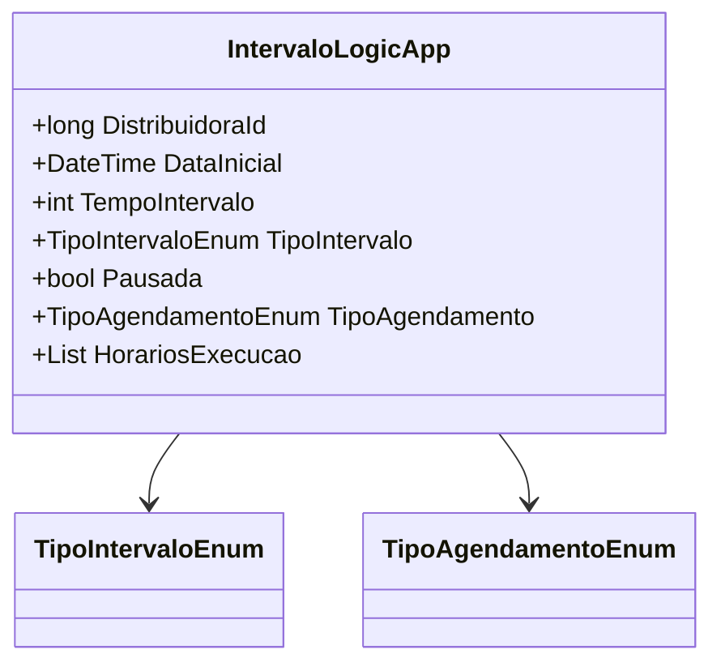

# IntervaloLogicApp
**Namespace**: IsthmusWinthor.Dominio.POCO  
**Nome do Arquivo**: IntervaloLogicApp.cs  

## Visão Geral e Responsabilidade
A classe `IntervaloLogicApp` serve como um motor de gerenciamento de agendamentos de execução de intervalos para distribuidores. Sua finalidade é controlar o tempo, tipo de intervalo e agendamento, incluindo a lógica para determinar se o intervalo está pausado com base em condições definidas. Esta classe é fundamental para assegurar que os agendamentos sejam configurados corretamente e que sua execução seja gerenciada de forma apropriada, atendendo aos parâmetros e regras de negócio relevantes.

## Métodos de Negócio
### Construtor: IntervaloLogicApp(long distribuidoraId, DateTime dataInicial, int tempoIntervalo, TipoIntervaloEnum tipoIntervalo, bool pausada, TipoAgendamentoEnum tipoAgendamento, List<TimeSpan> horariosExecucao) 
#### Objetivo:
Este construtor garante que um `IntervaloLogicApp` seja criado com valores válidos e que a lógica de pausa seja aplicada no momento da criação.

#### Comportamento:
1. Inicializa a propriedade `DistribuidoraId` com o valor fornecido.
2. Define `DataInicial` com a data de início fornecida.
3. Estabelece `TempoIntervalo` com o intervalo de tempo desejado.
4. Atribui `TipoIntervalo` ao tipo de intervalo fornecido.
5. Avalia se a instância deve ser considerada "pausada":
   - Se `pausada` for verdadeiro, a instância é marcada como pausada.
   - Se o `TipoAgendamento` for `HorarioEspecifico`, verifica se a lista `HorariosExecucao` está vazia; se estiver, a instância é marcada como pausada.

#### Retorno:
Não retorna valor, pois é um construtor.

### Construtor: IntervaloLogicApp(PipelineSincronizacaoAgendamentoDistribuidora agendamento)
#### Objetivo:
O construtor é responsável por instanciar um novo objeto `IntervaloLogicApp` a partir de um objeto do tipo `PipelineSincronizacaoAgendamentoDistribuidora`, promovendo uma engenharia reversa dos dados do agendamento.

#### Comportamento:
1. Inicializa `DistribuidoraId` a partir do `agendamento.DistribuidoraId`.
2. Define `DataInicial` usando `agendamento.DataInicial`.
3. Atribui `TempoIntervalo` usando `agendamento.TempoIntervalo`.
4. Define `TipoIntervalo` através de `agendamento.TipoIntervalo`.
5. Avalia se a instância deve ser considerada "pausada":
   - Se `agendamento.Pausada` for verdadeiro, está pausada.
   - Se o `TipoAgendamento` for `HorarioEspecifico`, e `agendamento.HorariosExecucao` estiver vazio, a instância é marcada como pausada.
6. Atribui `TipoAgendamento` de `agendamento.TipoAgendamento`.
7. Define `HorariosExecucao` utilizando `agendamento.HorariosExecucao`.

#### Retorno:
Não retorna valor, pois é um construtor.

## Propriedades Calculadas e de Validação
### Padrao
- **Regra:** A propriedade `Padrao` indica se a `DistribuidoraId` é menor ou igual a zero, representando um estado padrão onde não há uma distribuidora específica atribuída.

## Navigations Property
- Não há propriedades de navegação que sejam classes complexas do domínio.

## Tipos Auxiliares e Dependências
- **Enumerações:**
  - [TipoIntervaloEnum](TipoIntervaloEnum.md)
  - [TipoAgendamentoEnum](TipoAgendamentoEnum.md)

## Diagrama de Relacionamentos

---
Gerada em 29/12/2025 21:36:24
