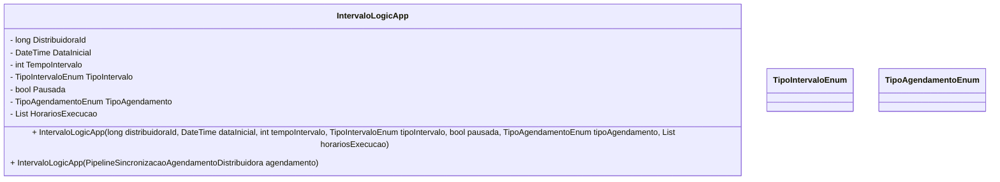

# IntervaloLogicApp
- **Namespace**: IsthmusWinthor.Dominio.POCO
- **Nome do Arquivo**: IntervaloLogicApp.cs

## Visão Geral e Responsabilidade
A classe `IntervaloLogicApp` tem a responsabilidade de gerenciar intervalos de execução para distribuidoras em um sistema de agendamento. Seu papel é fundamental para garantir que os intervalos de execução estejam corretos e que as regras estabelecidas para atividades de agendamento estejam sendo seguidas, permitindo validar se o agendamento está pausado ou se é padrão, além de auxiliar na configuração dos horários de execução.

## Métodos de Negócio
### Título: Construtor com parâmetros
**Visibilidade**: Público

#### Objetivo
Configurar um novo intervalo de execução de acordo com os dados fornecidos, implementando regras de validação associadas ao agendamento específico.

#### Comportamento
1. Recebe os parâmetros de entrada necessários para configurar o objeto.
2. Define o `DistribuidoraId` e a `DataInicial` para estabelecer a data de início do agendamento.
3. Atribui o `TempoIntervalo` e o `TipoIntervalo` para definir a periodicidade e tipo do intervalo.
4. Verifica se o agendamento deve ser considerado pausado - se `Pausada` for true ou se o agendamento é do tipo `HorarioEspecifico` e não possui horários definidos.
5. Inicializa a lista de `HorariosExecucao` com os horários especificados.

#### Retorno
Sem valor retornado; ele cria uma nova instância da classe.

### Título: Construtor a partir de PipelineSincronizacaoAgendamentoDistribuidora
**Visibilidade**: Público

#### Objetivo
Facilitar a criação de um `IntervaloLogicApp` a partir de um objeto de agendamento já existente, garantindo que todos os dados relevantes sejam transferidos corretamente.

#### Comportamento
1. Recebe um objeto do tipo `PipelineSincronizacaoAgendamentoDistribuidora`.
2. Atribui o `DistribuidoraId`, `DataInicial`, `TempoIntervalo`, `TipoIntervalo`, `Pausada`, `TipoAgendamento` e `HorariosExecucao` a partir do agendamento fornecido.
3. Verifica e aplica a lógica para determinar se o agendamento deve ser pausado da mesma forma que o construtor com parâmetros.

#### Retorno
Sem valor retornado; este método cria uma nova instância do `IntervaloLogicApp` a partir de um objeto existente.

## Propriedades Calculadas e de Validação
### Propriedade: `Padrao`
- **Regra**: Define se o agendamento é padrão, baseado no `DistribuidoraId`. Se o `DistribuidoraId` for menor ou igual a zero, o agendamento é considerado padrão.

## Navigations Property
- Não há propriedades de navegação que sejam classes complexas do domínio nesta implementação.

## Tipos Auxiliares e Dependências
- **Enum**: 
  - `[TipoIntervaloEnum](TipoIntervaloEnum.md)`
  - `[TipoAgendamentoEnum](TipoAgendamentoEnum.md)`

## Diagrama de Relacionamentos

