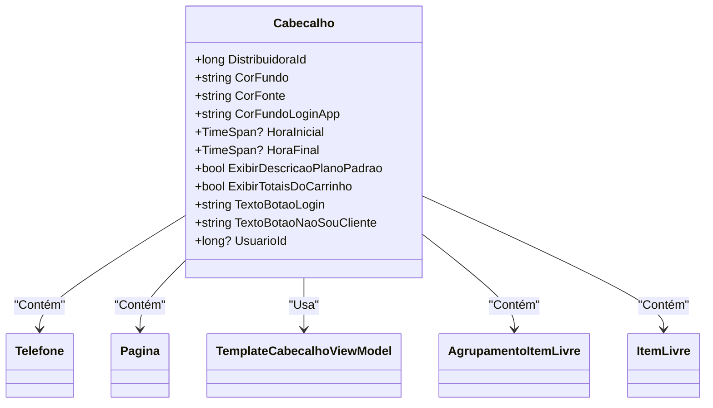

# Cabecalho
**Namespace**: IsthmusWinthor.Dominio.POCO.Layouts  
**Nome do Arquivo**: Cabecalho.cs  

## Visão Geral e Responsabilidade
A classe `Cabecalho` representa a camada de configuração visible de uma aplicação, abrangendo informações de apresentação, acesso a serviços e configurações visuais. O principal papel dessa classe é coletar e centralizar as propriedades de exibição necessárias para a interface de usuário, como cores e informações de contato, garantindo que a interface reflita corretamente as preferências de branding e usabilidade definidas pela distribuidora.

## Métodos de Negócio
A classe `Cabecalho` não possui métodos complexos com lógica de negócios. A maior parte de sua lógica gira em torno de propriedades de retorno e armazenamento.

## Propriedades Calculadas e de Validação
- **HoraInicial** (TimeSpan?): Essa propriedade calcula sua representação de `TimeSpan` a partir do armazenamento em `HoraInicialTicks`. Se `HoraInicialTicks` for maior que zero, converte o valor para `TimeSpan`. Caso contrário, retorna `null`.
  
- **HoraFinal** (TimeSpan?): Similar a `HoraInicial`, calcula um `TimeSpan` a partir de `HoraFinalTicks`. Retorna `null` se `HoraFinalTicks` não for positivo.

## Navigations Property
- [Telefone](Telefone.md): Representa um objeto relacionado que armazena informações de contato via WhatsApp.
- [Pagina](Pagina.md): Representa um link ou um objeto associado para ajuda dentro do contexto da aplicação.
- [TemplateCabecalhoViewModel](TemplateCabecalhoViewModel.md): Modelo que representa o template do cabeçalho da página.
- [AgrupamentoItemLivre](AgrupamentoItemLivre.md): Classe que representa os agrupamentos de itens livres associados a B2B e ao catálogo.
- [ItemLivre](ItemLivre.md): Classe que representa um item livre na plataforma.

## Tipos Auxiliares e Dependências
- [Telefone](Telefone.md): Classe necessária para representação de informações de contato.
- [TemplateCabecalhoViewModel](TemplateCabecalhoViewModel.md): Modelo que ajuda na configuração visual do cabeçalho.
- [AgrupamentoItemLivre](AgrupamentoItemLivre.md): Tipo auxiliar que apoia na manipulação de agrupamentos de itens livres.
- [ItemLivre](ItemLivre.md): Tipo auxiliar que representa itens livres específicos na configuração do cabeçalho.

## Diagrama de Relacionamentos

O diagrama acima ilustra as associações entre a classe `Cabecalho` e suas classes relacionadas, demonstrando como ela agrega e utiliza diferentes objetos para compor sua funcionalidade.
---
Gerada em 29/12/2025 21:43:17
