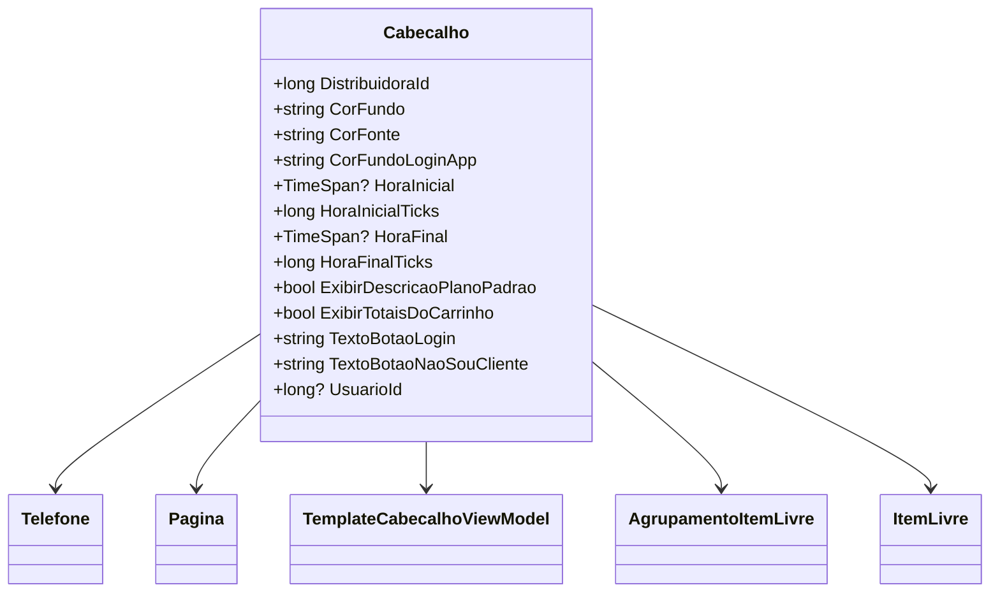

# Cabecalho
**Namespace**: IsthmusWinthor.Dominio.POCO.Layouts  
**Nome do Arquivo**: Cabecalho.cs  

## Visão Geral e Responsabilidade
A classe `Cabecalho` representa a estrutura de um cabeçalho em um sistema corporativo, responsável por armazenar as informações de configuração e apresentação de um layout, como cores, textos de botões e horários importantes. O principal problema de negócio que ela resolve é permitir a personalização visual e funcional de interfaces de sistemas através da inclusão de elementos como telefones e agrupamentos que facilitam a experiência do usuário em contextos B2B e de catálogo.

## Métodos de Negócio
Esta classe não possui métodos com lógica de negócios para documentar, focando apenas em propriedades.

## Propriedades Calculadas e de Validação

- **HoraInicial**
  - *Regra*: Essa propriedade converte `HoraInicialTicks` em um `TimeSpan?`, permitindo um gerenciamento mais eficiente de horários, pois lida com a representação em ticks para armazenagem e oferece a representação amigável de `TimeSpan` para o usuário.
  
- **HoraFinal**
  - *Regra*: Similar à `HoraInicial`, essa propriedade converte `HoraFinalTicks` em `TimeSpan?`, garantindo que o sistema possa manipular valores de tempo de forma intuitiva e legível.

## Navigation Property

- [Telefone](Telefone.md)
- [Pagina](Pagina.md)
- [TemplateCabecalhoViewModel](TemplateCabecalhoViewModel.md)
- [AgrupamentoItemLivre](AgrupamentoItemLivre.md)
- [ItemLivre](ItemLivre.md)

## Tipos Auxiliares e Dependências

- `Telefone`
- `Pagina`
- `TemplateCabecalhoViewModel`
- `AgrupamentoItemLivre`
- `ItemLivre`

## Diagrama de Relacionamentos

