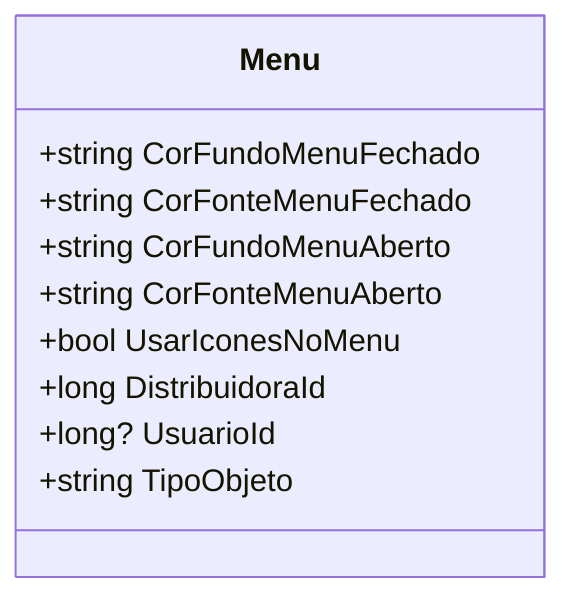

# Menu
- **Namespace**: IsthmusWinthor.Dominio.POCO.Layouts
- **Nome do Arquivo**: Menu.cs

### Visão Geral e Responsabilidade
A classe `Menu` representa a configuração de exibição de um sistema de menu, abrangendo propriedades relacionadas a cores e exibição de ícones. Ela também capta informações sobre o usuário que realiza a modificação, seja um usuário real ou um sistema automatizado. Essa classe ajuda a garantir que as configurações de menu sejam ajustadas de acordo com as preferências do usuário e a lógica do sistema.

### Propriedades Calculadas e de Validação
- **TipoObjeto**: Esta propriedade retorna o nome do tipo da classe. Sua finalidade é ajudar na identificação e categorização dessa classe em operações que possam depender do seu tipo. Não contém lógica complexa, mas é relevante para fins de identificação.

### Navigations Property
- Não há propriedades que representem classes complexas do domínio.

### Tipos Auxiliares e Dependências
- Não há enumeradores ou classes auxiliares utilizadas diretamente na classe `Menu`.

### Diagrama de Relacionamentos

Essa documentação tem como objetivo fornecer uma visão geral clara sobre a classe `Menu`, suas propriedades e sua responsabilidade no contexto do domínio, facilitando a compreensão para desenvolvedores e stakeholders interessados no sistema.
