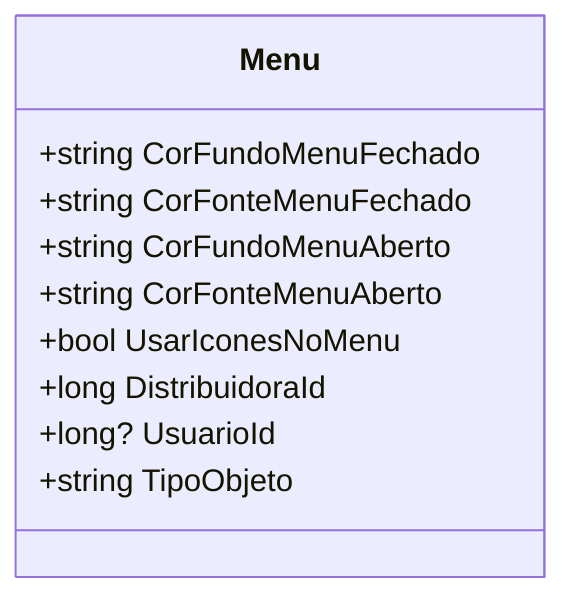

# Menu
**Namespace**: IsthmusWinthor.Dominio.POCO.Layouts  
**Nome do Arquivo**: Menu.cs  

## Visão Geral e Responsabilidade
A classe `Menu` representa a configuração de um menu no contexto do sistema. É responsável por armazenar as propriedades visuais (como cores de fundo e fonte) e comportamentais (como utilização de ícones) do menu, que serão utilizadas na interface do usuário. Essa configuração é essencial para garantir uma experiência de usuário coesa e visualmente agradável, além de armazenar informações sobre a origem da alteração ou criação do menu.

## Métodos de Negócio
Não há métodos com lógica de negócio definida além das propriedades simples.

## Propriedades Calculadas e de Validação
- **TipoObjeto**
  - Esta propriedade retorna o nome da classe atual (`Menu`). Ela é utilizada para identificar o tipo de objeto em operações dinâmicas dentro do sistema.

## Navigations Property
A classe `Menu` não possui navigations properties complexas que referenciam outras classes do domínio.

## Tipos Auxiliares e Dependências
Não há enumeradores ou classes estáticas/helpers utilizadas diretamente na classe `Menu`.

## Diagrama de Relacionamentos

---
Gerada em 29/12/2025 21:43:27
