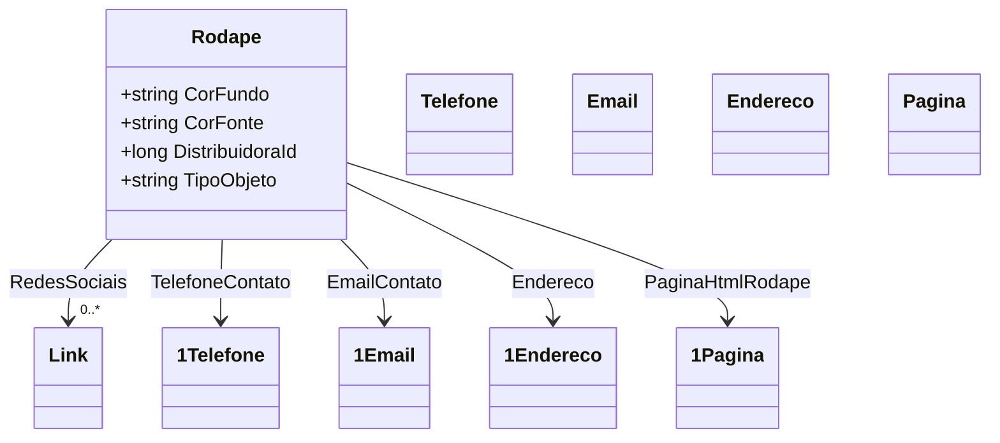

# Rodape
**Namespace**: IsthmusWinthor.Dominio.POCO.Layouts  
**Nome do Arquivo**: Rodape.cs  

## Visão Geral e Responsabilidade
A classe `Rodape` representa o rodapé de uma página em um sistema, com o objetivo de consolidar informações de contato, links de redes sociais e configurações de estilo visual (como cores). Essa estrutura é fundamental para garantir que os usuários tenham acesso a contatos relevantes e informações contextuais, proporcionando uma experiência de navegação mais integrada e informada. 

## Propriedades Calculadas e de Validação
- **TipoObjeto**: Esta propriedade é uma representação do tipo da classe, retornando o nome da classe como uma string. Ela não contém lógica de validação, mas pode ser útil para identificações dinâmicas de tipo em contextos de metadados ou introspecção. 

## Navigations Property
- **RedesSociais**: Representa uma lista de links para as redes sociais. Presumivelmente ligada à classe `[Link](Link.md)`.
- **TelefoneContato**: Uma instância da classe complexa `[Telefone](Telefone.md)` que representa o número de contato do rodapé.
- **EmailContato**: Uma instância da classe complexa `[Email](Email.md)` que representa o endereço de e-mail de contato.
- **Endereco**: Uma instância da classe complexa `[Endereco](Endereco.md)` que contém informações sobre a localização física.
- **PaginaHtmlRodape**: Uma instância da classe complexa `[Pagina](Pagina.md)` que representa a página HTML onde o rodapé será utilizado.

## Tipos Auxiliares e Dependências
- **Classes Utilizadas**: 
  - `[Link](Link.md)`
  - `[Telefone](Telefone.md)`
  - `[Email](Email.md)`
  - `[Endereco](Endereco.md)`
  - `[Pagina](Pagina.md)`

## Diagrama de Relacionamentos

Esta documentação técnica oferece uma visão clara sobre a responsabilidade, propriedades importantes e relações da classe `Rodape`, proporcionando uma base importante para desenvolvedores e arquitetos que trabalham no sistema.
