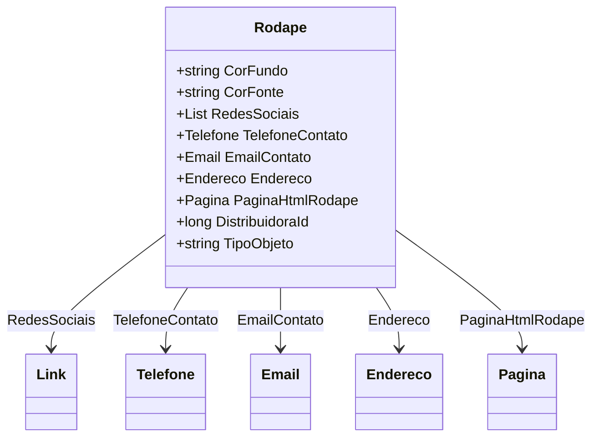

# Rodape
**Namespace**: IsthmusWinthor.Dominio.POCO.Layouts  
**Nome do Arquivo**: Rodape.cs  

## Visão Geral e Responsabilidade
A classe `Rodape` é um Rich Domain Model que representa os atributos e as funcionalidades de um rodapé em um layout de página. O rodapé é uma parte fundamental da experiência do usuário em uma interface, fornecendo informações de contato e links para redes sociais. Esta classe garante que os dados apresentados no rodapé sejam válidos e adequados, além de centralizar as informações essenciais de contato de uma distribuidora.

## Métodos de Negócio
### Título: TipoObjeto (ReadOnly)
- **Objetivo**: Este método fornece o tipo do objeto atual, permitindo identificar rapidamente a classe da instância.
- **Comportamento**: Ao invocar a propriedade `TipoObjeto`, o código verifica o tipo da instância (`this.GetType().Name`) e retorna como uma string.
- **Retorno**: Retorna o nome da classe como uma string, que ajuda na identificação da classe em contextos de serialização ou depuração.

## Propriedades Calculadas e de Validação
### Propriedade: TipoObjeto
- **Regra**: A propriedade `TipoObjeto` não requer validação, mas serve para identificar a classe do objeto, garantindo que o sistema tenha uma referência explícita do tipo em operação.

## Navigations Property
- [Link](Link.md) - Representa links para as redes sociais no rodapé.
- [Telefone](Telefone.md) - Representa informações de contato telefônico da distribuidora.
- [Email](Email.md) - Representa informações de contato via e-mail da distribuidora.
- [Endereco](Endereco.md) - Fornece o endereço físico da distribuidora.
- [Pagina](Pagina.md) - Representa a página HTML associada ao rodapé.

## Tipos Auxiliares e Dependências
- [Link](Link.md) - Enum ou classe que representa um link para redes sociais.
- [Telefone](Telefone.md) - Classe que encapsula a lógica relacionada a números de telefone.
- [Email](Email.md) - Classe que encapsula a lógica relacionada a e-mails.
- [Endereco](Endereco.md) - Classe que encapsula a lógica relacionada a endereços.

## Diagrama de Relacionamentos

---
Gerada em 29/12/2025 21:43:40
