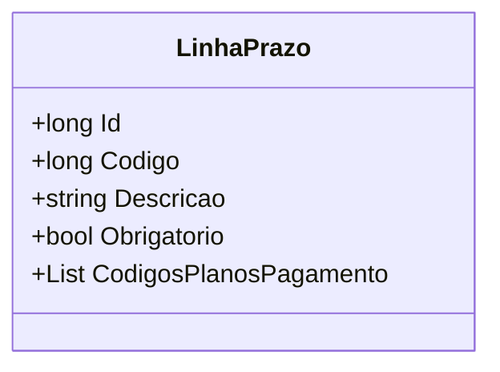

# LinhaPrazo
**Namespace**: IsthmusWinthor.Dominio.POCO  
**Nome do Arquivo**: LinhaPrazo.cs  

### Visão Geral e Responsabilidade
A classe `LinhaPrazo` representa uma linha de prazo num contexto de planejamento financeiro, armazenando detalhes sobre diferentes condições de pagamento. O modelo é fundamental para garantir que as regras de negócio relacionadas à obrigatoriedade e à seleção de planos de pagamento sejam sempre seguidas, facilitando a gestão adequada dos prazos em compromissos financeiros.

### Métodos de Negócio
A classe `LinhaPrazo` não contém métodos com lógica complexa ou regras de negócios que exijam documentação neste formato. Assim, iremos nos concentrar nas propriedades com lógica.

### Propriedades Calculadas e de Validação
- **Codigo**: Esta propriedade é um identificador único que deve ser verificado no contexto de sua operação. É importante garantir que cada código seja único dentro do sistema.
- **Obrigatorio**: Esta propriedade determina se a linha de prazo é obrigatória. O sistema deve garantir que, caso `Obrigatorio` seja `true`, a lógica de seleção de planos de pagamento respeite essa condição.

### Navigation Properties
- Não existem propriedades navegacionais complexas nesta classe.

### Tipos Auxiliares e Dependências
- Não há enumeradores ou classes auxiliares evidentes utilizadas.

### Diagrama de Relacionamentos

