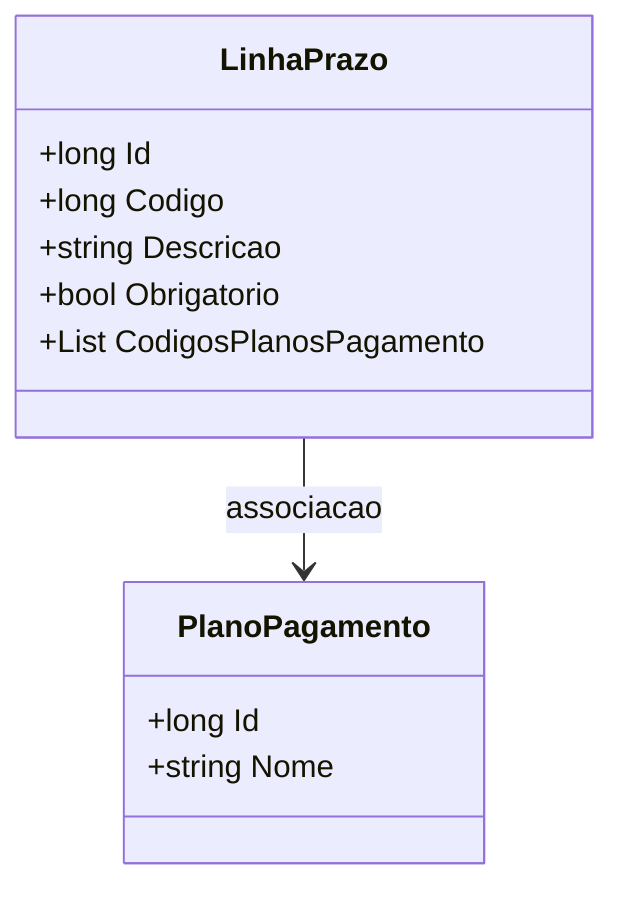

# LinhaPrazo
**Namespace**: IsthmusWinthor.Dominio.POCO  
**Nome do Arquivo**: LinhaPrazo.cs  

## Visão Geral e Responsabilidade
A classe `LinhaPrazo` representa uma linha de prazo que pode ser configurada em um sistema de gerenciamento de pagamentos. Através dela, é possível definir diferentes prazos, especificar se estes prazos são obrigatórios e associá-los a diferentes planos de pagamento. Essa estrutura permite que o sistema cuide de prazos relacionados a pagamentos de maneira flexível, garantindo que requisitos específicos sejam atendidos durante o processo de cobrança e gestão financeira.

## Métodos de Negócio
- **Título**: (não há métodos com lógica de negócio definida)

Atualmente, a classe não possui métodos que implementem lógica de negócio, sendo composta apenas por propriedades simples que armazenam dados.

## Propriedades Calculadas e de Validação
- **Código**: Necessita de validação para assegurar que representa um identificador único válido.
- **Obrigatorio**: Define se a linha de prazo é obrigatória ou não.

## Navigation Property
- **CodigosPlanosPagamento**: 
  - Representa uma lista de identificadores que se relacionam com planos de pagamento. Não há uma classe específica associada, mas esses códigos devem corresponder a uma classe externa responsável pela definição de planos de pagamento.

## Tipos Auxiliares e Dependências
- Não há enumeradores ou classes auxiliares utilizados diretamente nesta classe.

## Diagrama de Relacionamentos

Este diagrama ilustra uma associação entre a classe `LinhaPrazo` e uma hipotética classe `PlanoPagamento`, sugerindo um relacionamento onde uma linha de prazo está vinculada a múltiplos planos de pagamento através dos códigos armazenados na propriedade `CodigosPlanosPagamento`.
---
Gerada em 29/12/2025 21:36:35
