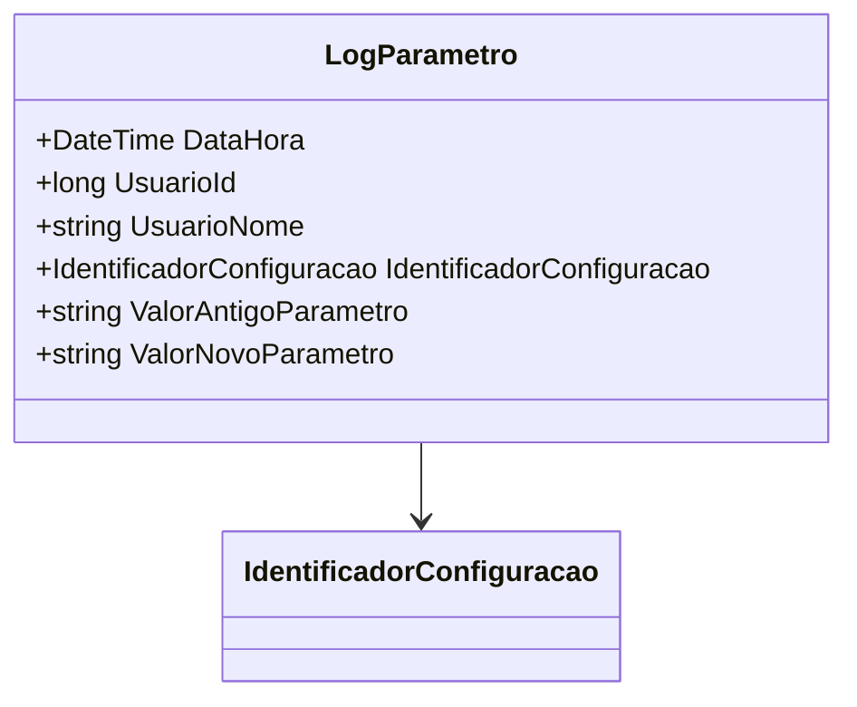

# LogParametro
**Namespace**: IsthmusWinthor.Dominio.POCO  
**Nome do Arquivo**: LogParametro.cs  

LogParametro é uma classe que transporta dados relacionados a alterações de parâmetros no sistema. Seu principal objetivo é registrar informações sobre a modificação, como o usuário responsável pela alteração, o antigo e o novo valor do parâmetro e a data e hora da modificação.

### Propriedades Calculadas e de Validação
- **IdentificadorConfiguracaoNome**: Esta propriedade é uma representação em string do valor do enumerador IdentificadorConfiguracao. Ele converte o enumerador para texto, facilitando a legibilidade em representações de log ou interfaces de usuário.

### Tipos Auxiliares e Dependências
- [IdentificadorConfiguracao](IdentificadorConfiguracao.md): Enum que representa as diferentes configurações de identificadores que podem ser logadas.

### Diagrama de Relacionamentos

---
Gerada em 29/12/2025 21:36:44
