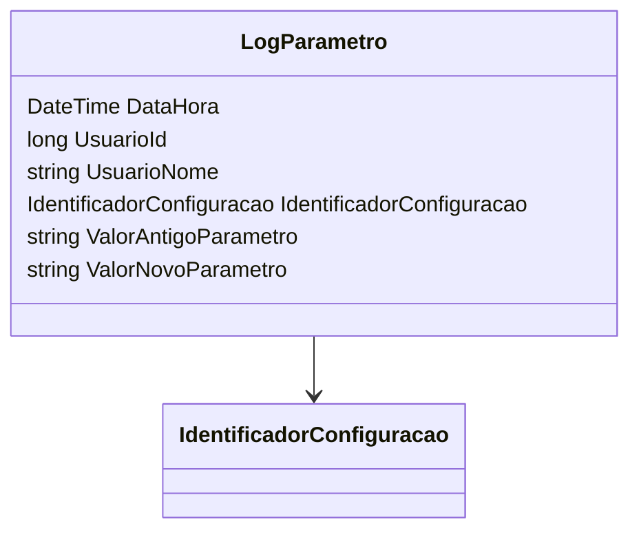

# LogParametro
**Namespace**: IsthmusWinthor.Dominio.POCO  
**Nome do Arquivo**: LogParametro.cs  

## Citação
A classe `LogParametro` é um objeto de transferência de dados (DTO) utilizado para encapsular informações sobre alterações em parâmetros do sistema, facilitando a auditoria e rastreamento de mudanças.

## Diagrama de Relacionamentos

