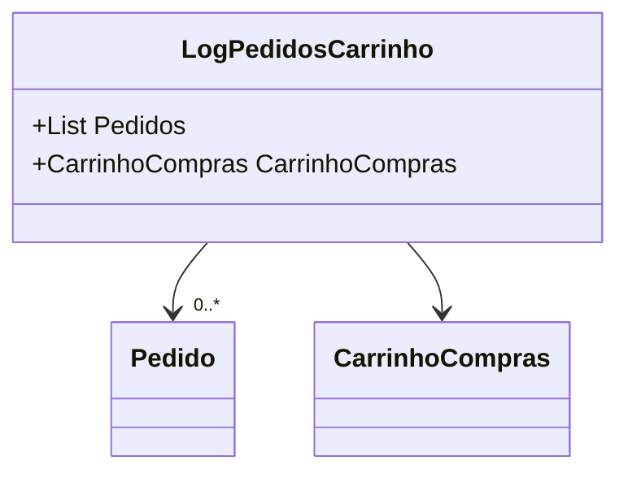

# LogPedidosCarrinho
- **Namespace**: IsthmusWinthor.Dominio.POCO
- **Nome do Arquivo**: LogPedidosCarrinho.cs

## Visão Geral e Responsabilidade
A classe `LogPedidosCarrinho` serve como um container que falha em consolidar informações relacionadas a pedidos e o carrinho de compras de um cliente. Sua principal responsabilidade é permitir o rastreamento e gerenciamento dos pedidos que foram adicionados ao carrinho, facilitando a visualização e controle das seleções de compras antes da finalização da compra. Isso é crucial para a integridade das operações de venda e para garantir que o cliente tenha uma experiência de usuário fluida ao finalizarem suas compras.

## Navegação de Propriedades
- `CarrinhoCompras`: [CarrinhoCompras](CarrinhoCompras.md)
- `Pedidos`: [Pedido](Pedido.md)

## Tipos Auxiliares e Dependências
- `Pedido`: [Pedido](Pedido.md)
- `CarrinhoCompras`: [CarrinhoCompras](CarrinhoCompras.md)

## Diagrama de Relacionamentos

---
Gerada em 29/12/2025 21:36:52
