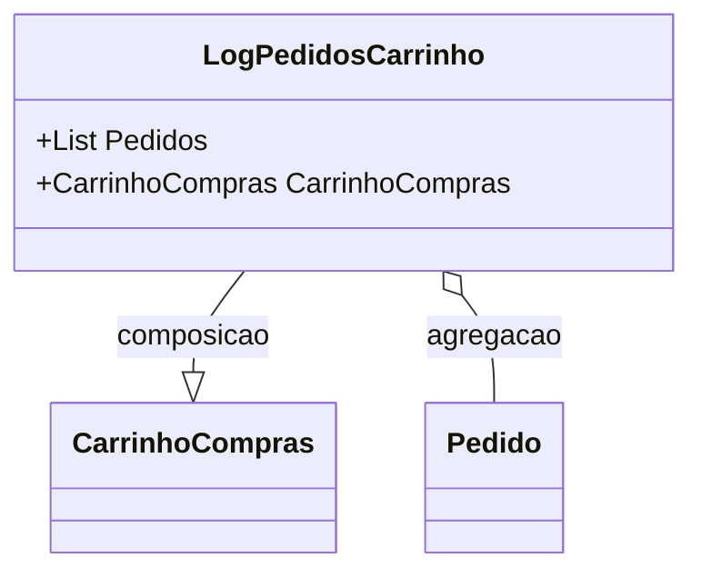

# LogPedidosCarrinho
**Namespace**: IsthmusWinthor.Dominio.POCO  
**Nome do Arquivo**: LogPedidosCarrinho.cs  

### Visão Geral e Responsabilidade
A classe `LogPedidosCarrinho` atua como um registro de pedidos associados a um carrinho de compras específico. Ela tem a responsabilidade de manter uma lista de pedidos e vinculá-los ao carrinho correspondente, essencial para o processamento e histórico de compras de um usuário em um sistema de e-commerce. Isso permite que a aplicação gerencie os pedidos de forma coerente dentro do contexto da experiência de compra.

### Métodos de Negócio
**Neste caso, a classe não contém métodos de negócio com lógica significativa, focando apenas em propriedades de transporte de dados. Portanto, esta seção está vazia.**

### Propriedades Calculadas e de Validação
**Neste caso, a classe não possui propriedades com lógica no `get` ou validação no `set`, focando apenas em propriedades simples. Portanto, esta seção está vazia.**

### Navigation Property
- `CarrinhoCompras` - Representa a classe que contém os detalhes do carrinho de compras.
  - [CarrinhoCompras](CarrinhoCompras.md)
  
- `Pedidos` - Uma lista de pedidos que são instâncias da classe `Pedido`.
  - [Pedido](Pedido.md)

### Tipos Auxiliares e Dependências
- Nenhum enumerador (Enum) ou classe estática/helper é utilizado nesta classe. Portanto, esta seção está vazia.

### Diagrama de Relacionamentos

