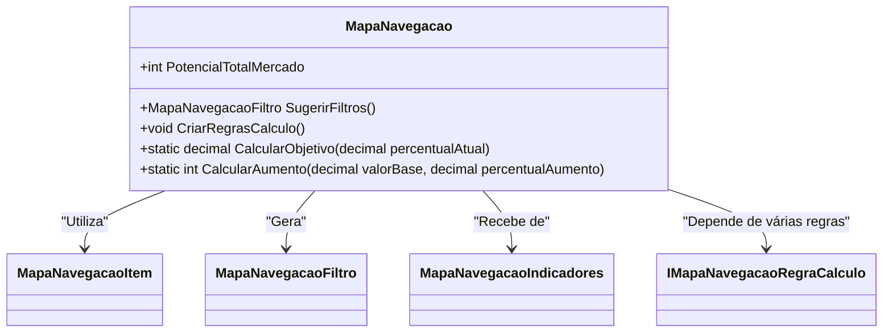

# MapaNavegacao
**Namespace**: IsthmusWinthor.Dominio.POCO.MapaNavegacaoDistribuidora  
**Nome do Arquivo**: MapaNavegacao.cs  

## Visão Geral e Responsabilidade
A classe `MapaNavegacao` atua como um motor de cálculo que facilita o mapeamento do desempenho de diversos objetivos comerciais em um contexto de atração, engajamento e vendas. Ela recebe indicadores e filtros para calcular a performance atual e sugere ações apropriadas para alcançar metas estabelecidas em cada fase do processo. Essa modelagem é crucial para acompanhamento e tomada de decisões estratégicas visando à maximização do potencial de mercado.

## Métodos de Negócio

### SugerirFiltros() - Public
- **Objetivo**: Sugere uma configuração de filtros que maximiza os objetivos comerciais baseados nas métricas atuais e no potencial do mercado.
- **Comportamento**:
  1. Cria um novo objeto `MapaNavegacaoFiltro` utilizando valores calculados dos objetivos dos três estágios de interação: atração, engajamento e venda.
  2. Calcula cada objetivo usando o método `CalcularObjetivo` e os valores obtidos de `AtrairBaseClientes`, `AtrairLoginLoginLiberados`, `EngajarSenhaGerada`, `EngajarComprasEfetuadas`, `VenderFrequenciaMes`, e `VenderTicketMedioMes`.
- **Retorno**: Retorna um objeto `MapaNavegacaoFiltro` que contém as sugestões de filtros ideais para os objetivos de negócio, facilitando a interpretação dos dados e o planejamento estratégico.

### CalcularObjetivo(decimal percentualAtual) - Private
- **Objetivo**: Calcula a meta futura baseada no percentual atual de performance.
- **Comportamento**:
  1. Recebe o percentual atual como entrada.
  2. Calcula um novo valor que é 20% do espaço restante até 100%, em 5 intervalos iguais.
- **Retorno**: Retorna o novo percentual objetivo calculado.

### CriarRegrasCalculo() - Private
- **Objetivo**: Inicializa as regras de cálculo necessárias para determinar as métricas nos diferentes estágios do mapa de navegação.
- **Comportamento**:
  1. Instancia as regras de cálculo para onde estamos e para onde vamos tanto em percentual como em divisão e multiplicação.
- **Retorno**: Não possui retorno.

### CalcularAumento(decimal valorBase, decimal percentualAumento) - Private
- **Objetivo**: Calcula um valor aumentado com base em um percentual informado.
- **Comportamento**:
  1. Recebe a base e o percentual de aumento.
  2. Calcula o aumento multiplicando a base pelo percentual e soma ao valor base.
- **Retorno**: Retorna um inteiro que representa o novo valor após o aumento.

```mermaid
flowchart TD
    A[Início] --> B[SugerirFiltros()]
    B --> C[Criação do MapaNavegacaoFiltro]
    C --> D[CalcularObjetivo]
    D --> E[Retorna novo percentual]
    C --> F[Repite para outros objetivos]
    F --> G[Fim]
```

## Propriedades Calculadas e de Validação
- **PotencialTotalMercado**: Esta propriedade é populada com um valor que pode ser oriundo do filtro ou calculado com base no número de clientes e um percentual de aumento. A lógica consiste em assegurar que o valor utilizado seja adequado ao contexto de negócios, garantindo integridade de dados na análise de potencial de mercado.

## Navigations Property
- [MapaNavegacaoItem](MapaNavegacaoItem.md) - Utilizada para representar cada item nos estágios de atração, engajamento e venda.

## Tipos Auxiliares e Dependências
- [MapaNavegacaoFiltro](MapaNavegacaoFiltro.md) - Classe utilizada para representar filtros de análise.
- [MapaNavegacaoIndicadores](MapaNavegacaoIndicadores.md) - Classe que contém indicadores relevantes para o cálculo das métricas.
- [IMapaNavegacaoRegraCalculo](IMapaNavegacaoRegraCalculo.md) - Interface referente às regras de cálculo a serem aplicadas.

## Diagrama de Relacionamentos

