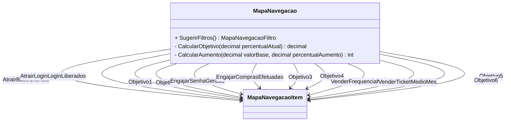

# MapaNavegacao
**Namespace**: IsthmusWinthor.Dominio.POCO.MapaNavegacaoDistribuidora  
**Nome do Arquivo**: MapaNavegacao.cs  

## Visão Geral e Responsabilidade
A classe `MapaNavegacao` atua como um motor de cálculo para a definição de uma estratégia comercial, permitindo a visualização de métricas sobre clientes em três etapas: Atrair, Engajar e Vender. A classe utiliza regras de cálculo para determinar o progresso e objetivos em relação a indicadores de mercado, ajudando a identificar potenciais aumentos no número de clientes e faturamento.

## Métodos de Negócio

### 1. MapaNavegacaoFiltro SugerirFiltros()
- **Título**: SugerirFiltros - Público
- **Objetivo**: Retornar um filtro sugerido baseado nas métricas calculadas, para orientar estratégias futuras de aquisição e engajamento de clientes.
- **Comportamento**:
  1. Cria um novo objeto `MapaNavegacaoFiltro`.
  2. Utiliza o `PotencialTotalMercado`.
  3. Para cada KPI (Key Performance Indicator), calcula o objetivo utilizando o método `CalcularObjetivo`.
  4. Retorna o filtro com os valores sugeridos.
- **Retorno**: Um objeto `MapaNavegacaoFiltro` com os valores sugeridos para planejamento estratégico.

### 2. private decimal CalcularObjetivo(decimal percentualAtual)
- **Título**: CalcularObjetivo - Privado
- **Objetivo**: Calcular um novo objetivo percentual incrementando o valor atual.
- **Comportamento**:
  1. Recebe o percentual atual.
  2. Calcula o novo objetivo adicionando 20% (1/5) do espaço restante até 100%.
  3. Retorna o novo percentual desejado.
- **Retorno**: Um decimal que representa o novo objetivo percentual calculado.

### 3. private int CalcularAumento(decimal valorBase, decimal percentualAumento)
- **Título**: CalcularAumento - Privado
- **Objetivo**: Determinar um novo valor com base em um percentual de aumento aplicado a um valor base.
- **Comportamento**:
  1. Recebe um valor base e um percentual de aumento.
  2. Calcula o aumento multiplicando o valor base pelo percentual dividido por 100.
  3. Converte e retorna o novo valor total.
- **Retorno**: Um inteiro representando o novo valor após aplicar o aumento.

## Propriedades Calculadas e de Validação
- A classe `MapaNavegacao` não possui propriedades com lógica de cálculo direta no `get` ou validação no `set`.

## Navigations Property
- `[MapaNavegacaoItem](MapaNavegacaoItem.md)` - Esta propriedade representa um item na navegação e é uma classe complexa que contém a lógica de valores variáveis para cada etapa de engajamento.

## Tipos Auxiliares e Dependências
- `[IMapaNavegacaoRegraCalculo](IMapaNavegacaoRegraCalculo.md)` - Interface utilizada para implementar regras de cálculo.
- `[RegraCalculoOndeEstamosPercentual](RegraCalculoOndeEstamosPercentual.md)` - Regra específica para cálculo de percentual em relação ao estado atual.
- `[RegraCalculoOndeEstamosDivisao](RegraCalculoOndeEstamosDivisao.md)` - Regra para cálculo de divisão aplicada a indicadores de vendas.
- `[RegraCalculoParaOndeVamosPercentual](RegraCalculoParaOndeVamosPercentual.md)` - Regra para cálculo percentual do destino futuro.
- `[RegraCalculoParaOndeVamosMultiplicacao](RegraCalculoParaOndeVamosMultiplicacao.md)` - Regra que executa multiplicação em indicadores de vendas.

## Diagrama de Relacionamentos

---
Gerada em 29/12/2025 21:44:10
