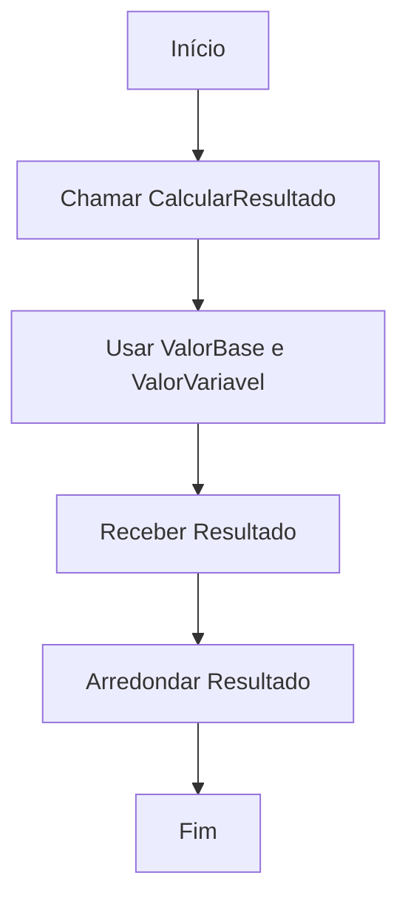
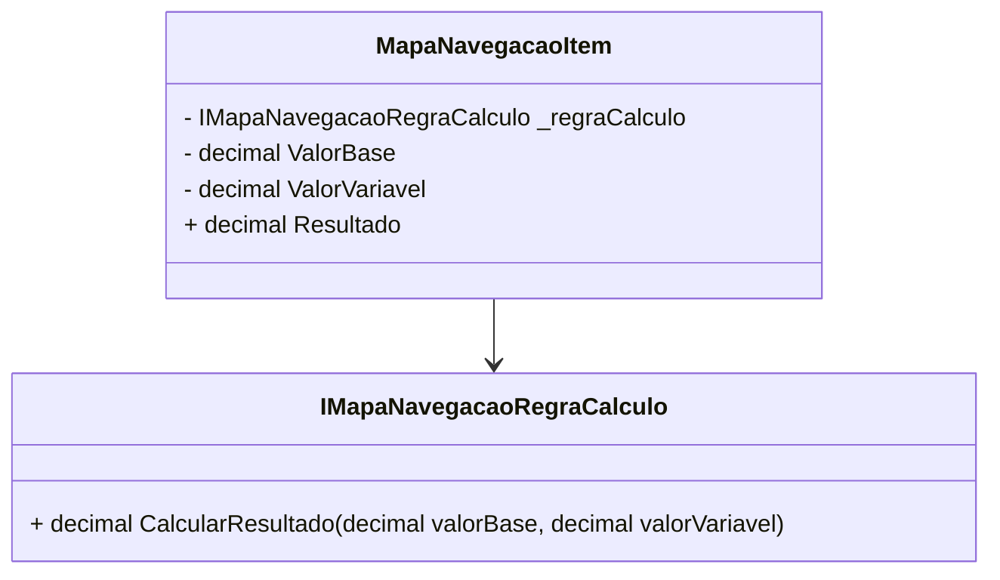

# MapaNavegacaoItem
**Namespace**: IsthmusWinthor.Dominio.POCO.MapaNavegacaoDistribuidora  
**Nome do Arquivo**: MapaNavegacaoItem.cs  

## Visão Geral e Responsabilidade
A classe `MapaNavegacaoItem` representa um item na estrutura de navegação da distribuidora, sendo responsável pelo cálculo de um resultado baseado em uma combinação de valores base e variáveis, aplicando uma regra de cálculo específica. A funcionalidade principal desta classe é fornecer um mecanismo para calcular um resultado financeiro ou de desempenho, assegurando que a lógica de cálculo pode ser aplicada de maneira flexível através do uso de uma interface para a regra de cálculo.

## Métodos de Negócio

### Título: Resultado (Propriedade pública)
- **Objetivo**: Garante o cálculo do resultado, aplicando a regra de cálculo fornecida à entrada de valores base e variáveis.
- **Comportamento**: 
   1. A propriedade `Resultado` é acessada.
   2. O método `CalcularResultado` da interface `_regraCalculo` é chamado, passando `ValorBase` e `ValorVariavel` como parâmetros.
   3. O resultado é arredondado para duas casas decimais antes de ser retornado.
- **Retorno**: Retorna um valor decimal que representa o resultado do cálculo com base nos valores fornecidos e na regra de cálculo implementada.

## Propriedades Calculadas e de Validação
- **Resultado**: Calcula o valor do resultado aplicando a regra de cálculo através da interface `IMapaNavegacaoRegraCalculo`. A regra de arredondamento para duas casas decimais deve ser aplicada para garantir a precisão no retorno do valor.

## Navigations Property
- A classe `MapaNavegacaoItem` não possui propriedades de navegação que sejam outras classes complexas do domínio.

## Tipos Auxiliares e Dependências
- **Interface**: `IMapaNavegacaoRegraCalculo`.

## Diagrama de Relacionamentos

Esta documentação possui um resumo da classe `MapaNavegacaoItem`, suas responsabilidades principais, as regras de negócio que garante através de seus métodos e propriedades, e um diagrama de classes que ilustra seu relacionamento com tipos auxiliares.
