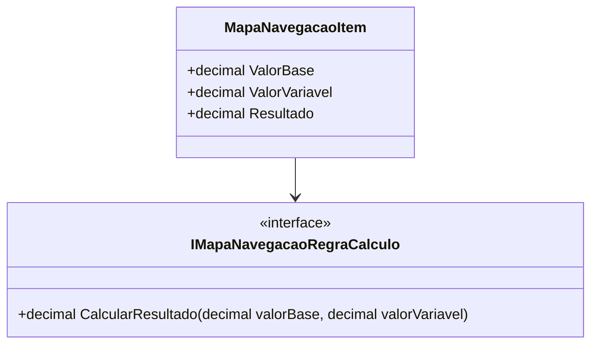

# MapaNavegacaoItem
- **Namespace**: IsthmusWinthor.Dominio.POCO.MapaNavegacaoDistribuidora
- **Nome do Arquivo**: MapaNavegacaoItem.cs

## Visão Geral e Responsabilidade
A classe `MapaNavegacaoItem` representa um item que é parte integrante do processo de cálculo de resultados em um contexto de navegação de distribuidora. Ela resolve a necessidade de realizar cálculos específicos com base em um valor fixo (`ValorBase`) e um valor variável (`ValorVariavel`), utilizando uma regra de cálculo definida por uma interface (`IMapaNavegacaoRegraCalculo`). Essa estrutura permite que diferentes regras de cálculo sejam integradas e utilizadas, proporcionando flexibilidade ao sistema.

## Métodos de Negócio

### Método: Resultado (Propriedade - Leitura)
- **Objetivo**: Garante o cálculo do resultado baseado nos valores `ValorBase` e `ValorVariavel` utilizando a implementação da regra de cálculo injetada.
- **Comportamento**:
  1. Invoca o método `CalcularResultado` da interface `_regraCalculo`, passando `ValorBase` e `ValorVariavel` como parâmetros.
  2. Recebe o resultado do cálculo.
  3. Arredonda o resultado para duas casas decimais.
- **Retorno**: Retorna o resultado do cálculo como um valor decimal, representando a combinação dos valores base e variável de acordo com a regra de cálculo aplicada.

## Propriedades Calculadas e de Validação

### Propriedade: Resultado
Essa propriedade calcula o resultado utilizando a lógica definida na regra de cálculo fornecida e garante que o valor retornado esteja sempre arredondado para duas casas decimais.

## Navigations Property
Nenhuma propriedade correspondente a classes complexas do domínio foi identificada nesta classe. A classe faz uso de uma interface, mas não possui navegações diretas para outras classes.

## Tipos Auxiliares e Dependências
- **Dependência**: `IMapaNavegacaoRegraCalculo` – Interface utilizada para definir a regra de cálculo que será aplicada nos valores.

## Diagrama de Relacionamentos

---
Gerada em 29/12/2025 21:44:23
