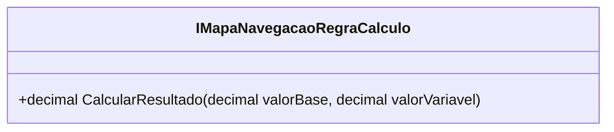

# IMapaNavegacaoRegraCalculo
**Namespace**: IsthmusWinthor.Dominio.POCO.MapaNavegacaoDistribuidora.Resultados  
**Nome do Arquivo**: IMapaNavegacaoRegraCalculo.cs

## Visão Geral e Responsabilidade
A interface `IMapaNavegacaoRegraCalculo` representa uma abstração para calcular resultados financeiros ou métricos em um contexto de navegação dentro da distribuição. Ela tem como responsabilidade fornecer um método que aplica regras de cálculo, possibilitando a implementação de diferentes estratégias de cálculo de resultados a partir de um valor base e um valor variável. Isso assegura a flexibilidade e a extensibilidade do sistema ao adicionar novas regras de cálculo quando necessário.

## Métodos de Negócio

### Método: `CalcularResultado` (public)
- **Objetivo**: Garantir que o resultado calculado seja derivado de um valor base e um valor variável através de uma fórmula definida pelas implementações.
- **Comportamento**: Este método aceita dois parâmetros, `valorBase` e `valorVariavel`. Ele deve ser implementado por classes concretas que definirão a lógica específica para calcular o resultado. A operação exata pode variar, mas sempre envolverá a utilização desses dois valores.
- **Retorno**: Retorna um `decimal` que representa o resultado do cálculo com base nos valores fornecidos.

## Propriedades Calculadas e de Validação
- Esta interface não define propriedades. O foco está na abstração de cálculo fornecida através do método `CalcularResultado`.

## Navigations Property
- Não há navegations properties, uma vez que essa é uma interface sem dependências diretas de classes complexas.

## Tipos Auxiliares e Dependências
- Não há tipos auxiliares ou enums diretamente associados a esta interface.

## Diagrama de Relacionamentos

Essa documentação fornece um entendimento claro da interface e sua função no cálculo de resultados dentro do contexto apropriado, dando ao desenvolvedor as informações necessárias para implementá-la adequadamente.
---
Gerada em 29/12/2025 21:44:39
