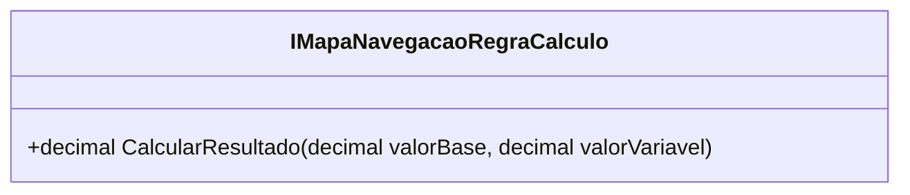

# IMapaNavegacaoRegraCalculo
**Namespace**: IsthmusWinthor.Dominio.POCO.MapaNavegacaoDistribuidora.Resultados  
**Nome do Arquivo**: IMapaNavegacaoRegraCalculo.cs  

## Visão Geral e Responsabilidade
A interface `IMapaNavegacaoRegraCalculo` define um contrato que deve ser implementado por classes responsáveis por calcular resultados com base em um valor base e um valor variável. O principal problema de negócio que essa interface resolve é a necessidade de encapsular diferentes estratégias de cálculo, permitindo que diferentes implementações atendam a regras de negócio específicas e proporcionem flexibilidade no sistema.

## Métodos de Negócio

### Título: `CalcularResultado` (public)
- **Objetivo**: Garantir que o cálculo do resultado atenda às regras específicas de cada implementação.
- **Comportamento**: Este método recebe dois parâmetros: `valorBase` e `valorVariavel`. Ele deve implementar a lógica para combinar esses valores de acordo com as regras de cálculo definidas, retornando um resultado que pode ser complexo, dependendo da implementação.
- **Retorno**: O método retorna um valor decimal que representa o resultado do cálculo. Este valor deve ser interpretado como a saída da lógica de negócios implementada na classe concreta que gera implementações dessa interface.

## Tipos Auxiliares e Dependências
- Essa interface, por ser apenas um contrato, não depende diretamente de tipos auxiliares ou enumeradores. Contudo, suas implementações podem necessitar deles para completar sua lógica de negócio.

## Diagrama de Relacionamentos

Esse diagrama ilustra que `IMapaNavegacaoRegraCalculo` é uma interface que define o método `CalcularResultado`. Implementações dessa interface devem ser criadas para oferecer diferentes lógicas de cálculo, mas aqui não foram listadas classes concretas, pois a interface em si não possui associações ou composições com outros objetos do domínio.
