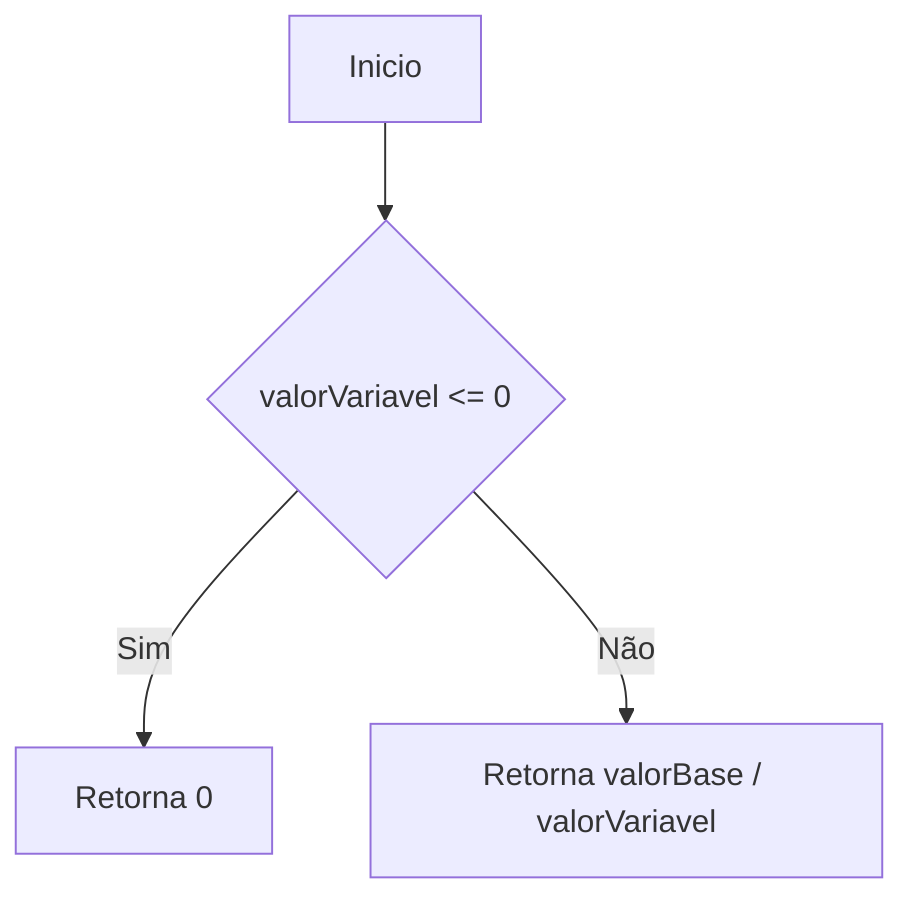
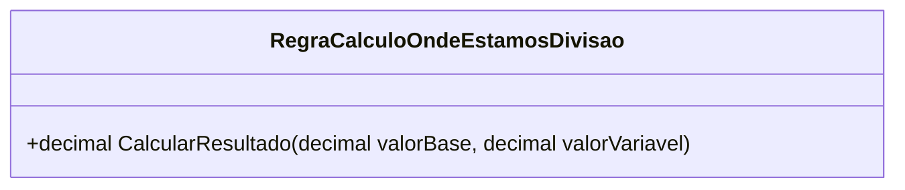

# RegraCalculoOndeEstamosDivisao
**Namespace**: IsthmusWinthor.Dominio.POCO.MapaNavegacaoDistribuidora.Resultados  
**Nome do Arquivo**: RegraCalculoOndeEstamosDivisao.cs  

## Visão Geral e Responsabilidade
A classe `RegraCalculoOndeEstamosDivisao` atua como um motor de cálculo que determina os resultados com base em uma divisão entre dois valores, representando uma lógica de negócio para processamento de resultados em um aplicativo corporativo. Ela resolve o problema de calcular uma proporção entre um valor base e um valor variável, permitindo uma análise mais direcionada de dados e resultados.

## Métodos de Negócio

### Título: CalcularResultado (public)
- **Objetivo**: Garante que o resultado da divisão somente ocorra se o `valorVariavel` for maior que zero, evitando divisão por zero e garantindo a integridade dos dados.
- **Comportamento**:
  1. Verifica se `valorVariavel` é menor ou igual a zero.
  2. Se a condição for verdadeira, o método retorna `0`, evitando a divisão.
  3. Caso contrário, calcula a divisão de `valorBase` por `valorVariavel` e retorna o resultado.
- **Retorno**: Retorna um `decimal` que representa o resultado da divisão, ou `0` se a condição inicial de `valorVariavel` não for satisfeita.

## Propriedades Calculadas e de Validação
- Não existem propriedades calculadas ou de validação nesta classe.

## Navigations Property
- Não existem propriedades de navegação nesta classe.

## Tipos Auxiliares e Dependências
- Não há enumeradores ou classes auxiliares utilizados nesta classe.

## Diagrama de Relacionamentos

---
Gerada em 29/12/2025 21:44:50
