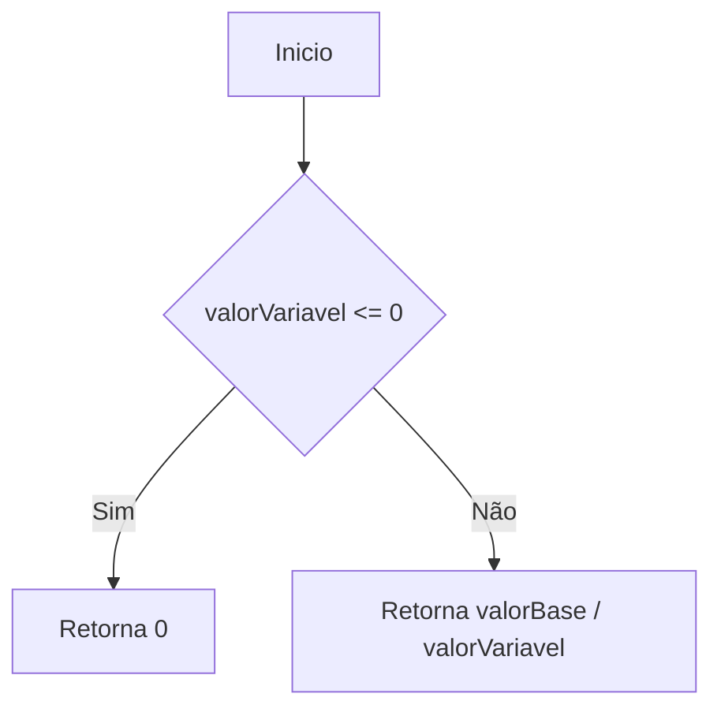
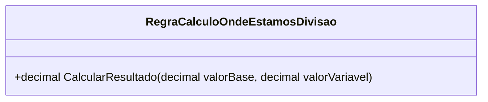

# RegraCalculoOndeEstamosDivisao
**Namespace**: IsthmusWinthor.Dominio.POCO.MapaNavegacaoDistribuidora.Resultados  
**Nome do Arquivo**: RegraCalculoOndeEstamosDivisao.cs  

## Visão Geral e Responsabilidade
A classe `RegraCalculoOndeEstamosDivisao` atua como um motor de cálculo que determina a relação entre dois valores, representando a lógica de negócio necessária para calcular o resultado de uma divisão específica. Ela resolve o problema de calcular uma proporção entre `valorBase` e `valorVariavel`, permitindo que a aplicação obtenha insights valiosos sobre a divisão de uma quantia em relação a um parâmetro variável.

## Métodos de Negócio

### CalcularResultado (Público)
- **Objetivo**: Garante que o cálculo entre dois valores seja feito corretamente, evitando divisões inválidas.
- **Comportamento**:
  1. Recebe dois parâmetros: `valorBase` e `valorVariavel`.
  2. Verifica se `valorVariavel` é menor ou igual a zero.
     - Se for verdadeiro, retorna 0, evitando uma divisão por zero ou um resultado inválido.
  3. Se não for, realiza a divisão do `valorBase` pelo `valorVariavel` e retorna o resultado.
- **Retorno**: Retorna um `decimal` que é o resultado da divisão. Um retorno de 0 indica que a divisão não pôde ser realizada devido a um valor inválido de `valorVariavel`.

## Propriedades Calculadas e de Validação
A classe em si não possui propriedades calculadas ou de validação, uma vez que o foco está na operação de cálculo do método.

## Navigations Property
Não existem classes complexas do domínio referenciadas nesta classe.

## Tipos Auxiliares e Dependências
Não há enumeradores ou classes estáticas/helpers utilizadas nesta classe.

## Diagrama de Relacionamentos

Esta documentação fornece uma visão clara da lógica de negócios envolvida na classe `RegraCalculoOndeEstamosDivisao`, detalhando seu funcionamento e suas responsabilidades dentro do sistema.
