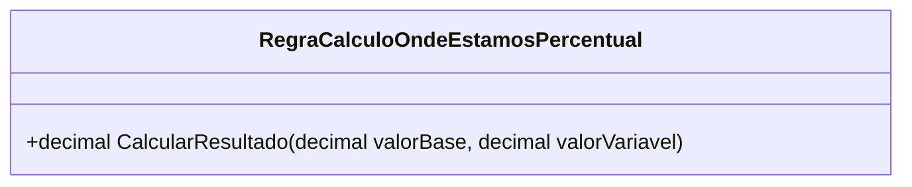

# RegraCalculoOndeEstamosPercentual
**Namespace**: IsthmusWinthor.Dominio.POCO.MapaNavegacaoDistribuidora.Resultados  
**Nome do Arquivo**: RegraCalculoOndeEstamosPercentual.cs  

## Visão Geral e Responsabilidade
A classe `RegraCalculoOndeEstamosPercentual` é responsável por calcular a porcentagem de um valor variável em relação a um valor base. Este cálculo é fundamental para a análise de desempenho, permitindo que os usuários entendam quanto do valor base é representado pelo valor variável. A presença de uma lógica de verificação para garantir que o valor base não seja menor ou igual a zero previne erros de divisão e garante integridade nos cálculos.

## Métodos de Negócio

### Título: `CalcularResultado` (public)
- **Objetivo**: Este método garante que o cálculo de porcentagem seja realizado de forma segura, evitando divisões por zero e retornando sempre um valor válido.
  
- **Comportamento**:
  1. O método recebe dois parâmetros: `valorBase` e `valorVariavel`.
  2. Verifica se `valorBase` é menor ou igual a zero.
     - Se sim, retorna `0` como resultado.
  3. Se `valorBase` for maior que zero, calcula a porcentagem: `(valorVariavel * 100) / valorBase`.
  4. Retorna o resultado do cálculo.

- **Retorno**: O método retorna um `decimal` que representa a porcentagem do `valorVariavel` em relação ao `valorBase`. Se `valorBase` for inválido (<= 0), o retorno é `0`.

```mermaid
flowchart TD
    A[Início]
    A --> B{valorBase <= 0?}
    B -->|Sim| C[Retorna 0]
    B -->|Não| D[Calcula (valorVariavel * 100) / valorBase]
    D --> E[Retorna resultado]
```

## Propriedades Calculadas e de Validação
- Não existem propriedades com lógica de cálculo ou validação na classe.

## Navigations Property
- Não existem propriedades que sejam classes complexas do domínio na classe.

## Tipos Auxiliares e Dependências
- Não há enumeradores ou classes auxiliares utilizadas por `RegraCalculoOndeEstamosPercentual`.

## Diagrama de Relacionamentos

