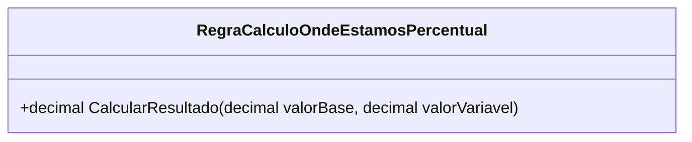

# RegraCalculoOndeEstamosPercentual
**Namespace**: IsthmusWinthor.Dominio.POCO.MapaNavegacaoDistribuidora.Resultados  
**Nome do Arquivo**: RegraCalculoOndeEstamosPercentual.cs  

## Visão Geral e Responsabilidade
A classe `RegraCalculoOndeEstamosPercentual` é responsável por calcular a porcentagem de um valor variável em relação a um valor base. Essa classe resolve o problema de negócio de quantificar a contribuição de uma variável em um contexto maior, proporcionando uma visão clara de performance relativa. É especialmente útil quando é necessário avaliar o desempenho ou a evolução de métricas, como resultados financeiros ou indicadores de performance.

## Métodos de Negócio

### Título: CalcularResultado (public)
- **Objetivo**: Garante que o cálculo da porcentagem entre `valorVariavel` e `valorBase` seja realizado de forma correta, levando em consideração a integridade dos dados ao evitar divisões por zero.
- **Comportamento**: 
  1. Verifica se o `valorBase` é menor ou igual a zero.
     - Se sim, retorna `0` como resultado, evitando erro de divisão.
  2. Caso contrário, calcula a porcentagem utilizando a fórmula `(valorVariavel * 100) / valorBase` e retorna o resultado.
- **Retorno**: O método retorna um valor decimal que representa o percentual calculado, ou `0` caso a condição de validacão inicial (valorBase <= 0) seja satisfeita.

```mermaid
flowchart TD
    A[valorBase <= 0?] -->|Sim| B[Retornar 0]
    A -->|Não| C[Calcular (valorVariavel * 100) / valorBase]
    C --> D[Retornar resultado]
```

## Propriedades Calculadas e de Validação
Não há propriedades na classe que apresentam lógica no `get` ou validação no `set`.

## Navigations Property
Esta classe não contém propriedades que são classes complexas do domínio.

## Tipos Auxiliares e Dependências
Não há enumeradores (Enums) ou classes estáticas/Helpers que a classe utiliza.

## Diagrama de Relacionamentos

---
Gerada em 29/12/2025 21:45:03
