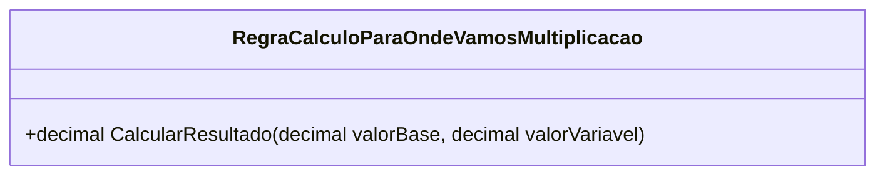

# RegraCalculoParaOndeVamosMultiplicacao
**Namespace**: IsthmusWinthor.Dominio.POCO.MapaNavegacaoDistribuidora.Resultados  
**Nome do Arquivo**: RegraCalculoParaOndeVamosMultiplicacao.cs  

## Visão Geral e Responsabilidade
A classe `RegraCalculoParaOndeVamosMultiplicacao` é responsável por encapsular a lógica de cálculo necessário para determinar um resultado financeiro a partir de dois valores, `valorBase` e `valorVariavel`. Seu propósito é facilitar a multiplicação desses valores, o que pode ser um componente vital em processos de preços dinâmicos ou flutuações em cenários de vendas, onde o cálculo de resultados é frequente e crítico para a tomada de decisões.

## Métodos de Negócio

### Título: `CalcularResultado` (public)
#### Objetivo:
Este método garante que o cálculo entre dois valores seja realizado corretamente, assegurando a integridade das operações matemáticas fundamentais utilizadas na lógica de negócios.

#### Comportamento:
1. O método recebe dois parâmetros do tipo `decimal`, denominados `valorBase` e `valorVariavel`.
2. Realiza a multiplicação de `valorBase` e `valorVariavel`.
3. Retorna o resultado da multiplicação como um valor `decimal`.

#### Retorno:
O valor retornado é um `decimal` que representa o resultado da multiplicação entre `valorBase` e `valorVariavel`.

## Propriedades Calculadas e de Validação
Não existem propriedades calculadas ou de validação nesta classe. A lógica se concentra exclusivamente no método de cálculo.

## Navigation Property
Não existem propriedades complexas de domínio dentro desta classe.

## Tipos Auxiliares e Dependências
Não existem enumeradores ou classes auxiliares diretamente utilizadas pela classe `RegraCalculoParaOndeVamosMultiplicacao`.

## Diagrama de Relacionamentos

---
Gerada em 29/12/2025 21:45:13
