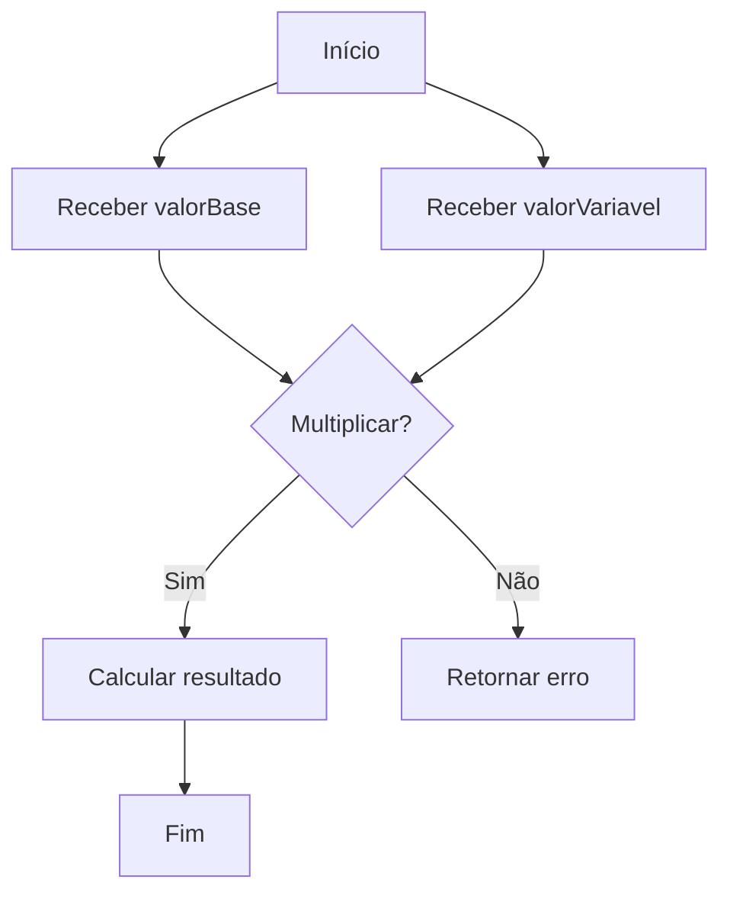
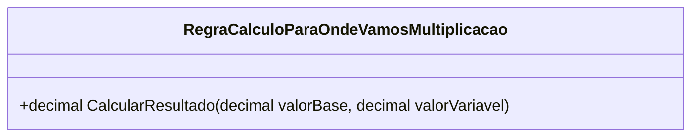

# RegraCalculoParaOndeVamosMultiplicacao
**Namespace**: IsthmusWinthor.Dominio.POCO.MapaNavegacaoDistribuidora.Resultados  
**Nome do Arquivo**: RegraCalculoParaOndeVamosMultiplicacao.cs  

## Visão Geral e Responsabilidade
A classe `RegraCalculoParaOndeVamosMultiplicacao` representa uma regra de cálculo essencial na camada de domínio do sistema. Seu papel é realizar a multiplicação entre um valor base e um valor variável, essencial em contextos onde ajustes de valor precisam ser calculados com precisão, como em situações financeiras ou logísticas no sistema de navegação.

## Métodos de Negócio

### Título: `CalcularResultado` (Public)
- **Objetivo**: Este método garante a regra de negócio de calcular o resultado de uma multiplicação entre um valor base e um valor variável, crucial para cenários que dependem de cálculos dinâmicos.
- **Comportamento**:
  1. Recebe dois parâmetros: `valorBase` e `valorVariavel`.
  2. Realiza a multiplicação entre esses dois valores.
  3. Retorna o resultado da multiplicação.
  
- **Retorno**: O método retorna um `decimal`, que representa o resultado do cálculo da multiplicação, que pode ser utilizado em decisões subsequentes dentro do sistema.

### Visualização

## Propriedades Calculadas e de Validação
Não existem propriedades calculadas ou de validação nesta classe, pois a lógica de negócio é encapsulada exclusivamente no método `CalcularResultado`.

## Navigations Property
Não há propriedades que são classes complexas do domínio nesta classe.

## Tipos Auxiliares e Dependências
Não existem Enumeradores ou Classes Estáticas/Helpers utilizadas nesta classe.

## Diagrama de Relacionamentos

