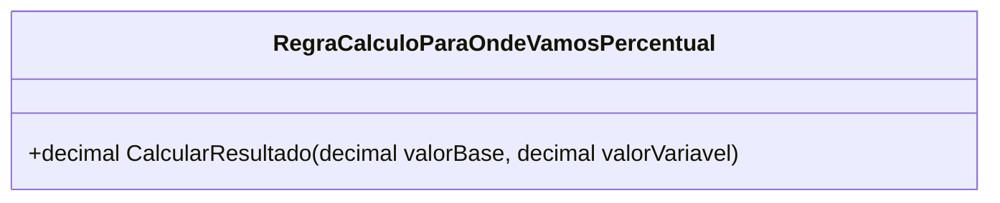

# RegraCalculoParaOndeVamosPercentual
**Namespace**: IsthmusWinthor.Dominio.POCO.MapaNavegacaoDistribuidora.Resultados  
**Nome do Arquivo**: RegraCalculoParaOndeVamosPercentual.cs  

## Visão Geral e Responsabilidade
A classe `RegraCalculoParaOndeVamosPercentual` atua como um motor de cálculo responsável por determinar o resultado percentual com base em um valor base e um valor variável. Esta classe resolve o problema de calcular de forma precisa o impacto percentual de uma variação sobre um valor inicial, fundamental em contextos financeiros e de planejamento.

## Métodos de Negócio

### Título: `CalcularResultado` (public)
- **Objetivo**: Garante que o cálculo do percentual somente ocorra quando o valor base for maior que zero, evitando assim resultados inválidos como divisão por zero.
- **Comportamento**:
  1. Verifica se o `valorBase` é menor ou igual a zero.
     - Se sim, retorna 0, assegurando que o cálculo não será realizado.
  2. Se o `valorBase` for válido, calcula o percentual do `valorVariavel` em relação ao `valorBase` utilizando a fórmula `(valorVariavel / 100) * valorBase`.
  3. Retorna o resultado do cálculo.
- **Retorno**: Retorna um valor decimal que representa o resultado do cálculo percentual. Se o `valorBase` for zero ou negativo, retorna 0.

```mermaid
flowchart TD
    A[valorBase <= 0?] -->|Sim| B[Retorna 0]
    A -->|Não| C[Calcular (valorVariavel / 100) * valorBase]
    C --> D[Retorna resultado]
```

## Propriedades Calculadas e de Validação
Não há propriedades com lógica de cálculo ou validação dentro da classe.

## Navigation Property
Não existem propriedades que são classes complexas do domínio dentro desta classe.

## Tipos Auxiliares e Dependências
Não há enumeradores ou classes estáticas/helpers utilizadas pela classe `RegraCalculoParaOndeVamosPercentual`.

## Diagrama de Relacionamentos

---
Gerada em 29/12/2025 21:45:24
