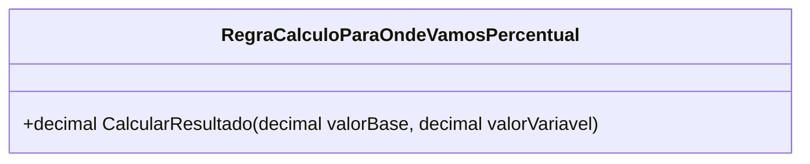

# RegraCalculoParaOndeVamosPercentual
**Namespace**: IsthmusWinthor.Dominio.POCO.MapaNavegacaoDistribuidora.Resultados  
**Nome do Arquivo**: RegraCalculoParaOndeVamosPercentual.cs  

## Visão Geral e Responsabilidade
A classe `RegraCalculoParaOndeVamosPercentual` é responsável por calcular um resultado percentual com base em dois valores: um valor base e um valor variável. O problema de negócio que ela resolve é a obtenção de um resultado percentual que pode ser utilizado em análises financeiras, projeções ou simulações de resultados conforme variáveis que mudam no contexto de distribuição.

## Métodos de Negócio

### Título: `CalcularResultado` (public)
- **Objetivo**: Este método garante que o cálculo do percentual associado a um valor base é realizado corretamente, considerando uma validação inicial.
- **Comportamento**: 
  1. O método recebe dois parâmetros: `valorBase` e `valorVariavel`.
  2. Ele verifica se o `valorBase` é menor ou igual a zero. Se for, retorna 0.
  3. Caso o `valorBase` seja válido, o método calcula o percentual de `valorVariavel` sobre `valorBase` através da fórmula `(valorVariavel / 100) * valorBase` e retorna o resultado desse cálculo.
- **Retorno**: Retorna um `decimal` que representa o resultado do cálculo percentual. Se o `valorBase` for inválido, retorna `0`.

```mermaid
flowchart TD
    A[Início] --> B{valorBase <= 0?}
    B -- Sim --> C[Retorna 0]
    B -- Não --> D[Calcula (valorVariavel / 100) * valorBase]
    D --> E[Retorna resultado]
```

## Propriedades Calculadas e de Validação
Não existem propriedades calculadas ou de validação nesta classe, uma vez que ela contém apenas um método com lógica de negócios.

## Navigations Property
Não há propriedades que são classes complexas do domínio nesta classe.

## Tipos Auxiliares e Dependências
Não existem enumeradores ou classes estáticas/helpers utilizadas especificamente nesta classe.

## Diagrama de Relacionamentos

