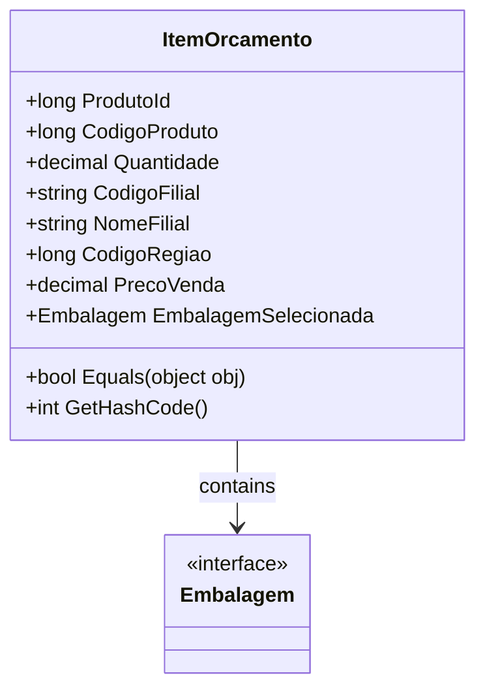

# ItemOrcamento
**Namespace**: IsthmusWinthor.Dominio.POCO.Orcamentos  
**Nome do Arquivo**: ItemOrcamento.cs  

## Visão Geral e Responsabilidade
A classe `ItemOrcamento` representa um item dentro de um orçamento, encapsulando informações essenciais sobre um produto específico em um contexto de vendas, tais como identificadores, quantidade e preço de venda. Essa classe é fundamental para o gerenciamento de orçamentos, permitindo o alinhamento entre os produtos, suas características e os locais de venda. Seu papel é garantir a integridade dos dados e a correta identificação dos itens orçados.

## Métodos de Negócio

### Título: Equals (Protected)
- **Objetivo**: Garantir a equivalência lógica entre dois objetos `ItemOrcamento`.
- **Comportamento**: 
  1. Verifica se o objeto passado (`obj`) é um `ItemOrcamento`.
  2. Compara os valores das propriedades `ProdutoId`, `CodigoProduto` e `Quantidade`.
  3. Retorna `true` se todas as propriedades relevantes forem iguais; caso contrário, retorna `false`.
- **Retorno**: Indica se dois objetos são considerados equivalentes baseados nas propriedades-chave que definem um item orçamentário.

### Título: GetHashCode (Protected)
- **Objetivo**: Fornecer um código de hash único para o objeto `ItemOrcamento`.
- **Comportamento**: 
   1. Combina os valores das propriedades `ProdutoId`, `CodigoProduto` e `Quantidade` em um código de hash único.
   2. O resultado é utilizado para operações em coleções baseadas em hash, como tabelas de hash.
- **Retorno**: Um valor inteiro que representa o código de hash do objeto, garantindo a integridade de operações que baseiam-se em hash.

## Propriedades Calculadas e de Validação
- Não existem propriedades com lógica no `get` ou validação no `set` nesta classe.

## Navigations Property
- `EmbalagemSelecionada`: [Embalagem](Embalagem.md)

## Tipos Auxiliares e Dependências
- `Embalagem`: [Embalagem](Embalagem.md)

## Diagrama de Relacionamentos

---
Gerada em 29/12/2025 21:45:37
