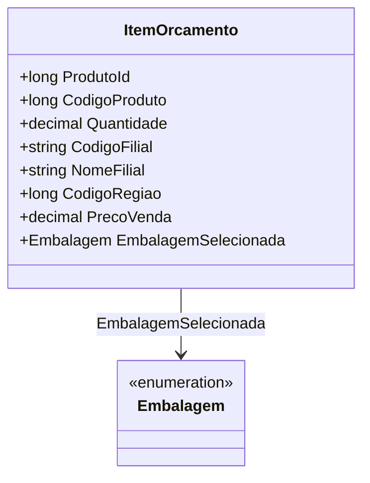

# ItemOrcamento
**Namespace**: IsthmusWinthor.Dominio.POCO.Orcamentos  
**Nome do Arquivo**: ItemOrcamento.cs  

## Visão Geral e Responsabilidade
A classe `ItemOrcamento` representa um item de um orçamento, encapsulando detalhes sobre o produto, suas quantidades e informações da filial e região. Ela é responsável por garantir a integridade e a equivalência de dados referentes a itens orçamentários, atuando como uma entidade essencial dentro do contexto de orçamentos em um sistema de gestão.

## Métodos de Negócio
### Título: Equals (public override)
- **Objetivo**: Garante que dois itens de orçamento sejam considerados iguais se possuírem o mesmo `ProdutoId`, `CodigoProduto` e `Quantidade`.
- **Comportamento**: 
  - Verifica se o objeto passado é do tipo `ItemOrcamento`.
  - Compara os valores de `ProdutoId`, `CodigoProduto` e `Quantidade` entre o objeto atual e o objeto passado como parâmetro.
  - Retorna `true` se todos os valores forem iguais, caso contrário, retorna `false`.
- **Retorno**: Um valor booleano que indica se os itens orçamentários são equivalentes.

### Título: GetHashCode (public override)
- **Objetivo**: Garante que dois itens de orçamento iguais tenham o mesmo valor de hash, o que é fundamental para o funcionamento correto em coleções hash.
- **Comportamento**: 
  - Utiliza o método `HashCode.Combine` para gerar um valor de hash baseado nos campos `ProdutoId`, `CodigoProduto` e `Quantidade`.
- **Retorno**: Um inteiro que representa o hash da instância do `ItemOrcamento`.

## Propriedades Calculadas e de Validação
- Não existem propriedades com lógica de cálculo no `get` ou validação no `set` nesta classe.

## Navigations Property
- `Embalagem EmbalagemSelecionada`: Esta propriedade referencia uma embalagem associada ao item de orçamento.
  - [Embalagem](Embalagem.md)

## Tipos Auxiliares e Dependências
- Não há enums ou classes estáticas auxiliares sendo utilizadas diretamente nesta classe.

## Diagrama de Relacionamentos

--- 

A documentação acima fornece uma visão técnica das regras de negócios, integridade de dados e visualização de fluxos relacionados ao `ItemOrcamento`, seguindo os padrões estabelecidos.
