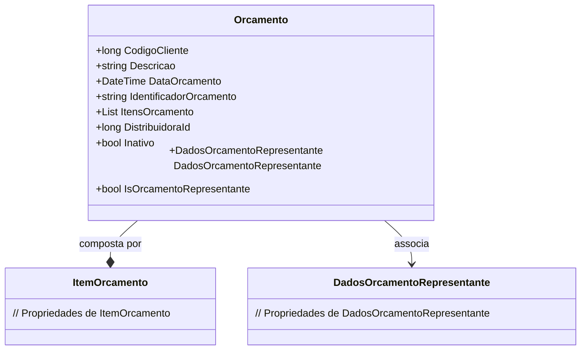

# Orcamento
**Namespace**: IsthmusWinthor.Dominio.POCO.Orcamentos  
**Nome do Arquivo**: Orcamento.cs  

## Visão Geral e Responsabilidade
A classe `Orcamento` representa uma proposta de orçamento para um cliente, contendo detalhes essenciais que ajudam a identificar a proposta, os itens que a compõem, e informações do representante associado. Esta classe é fundamental para o gerenciamento de orçamentos em um sistema corporativo, permitindo acompanhar as propostas feitas a clientes e suas respectivas condições, crucial para a tomada de decisão e controle financeiro.

## Métodos de Negócio
### IsOrcamentoRepresentante: Propriedade
**Objetivo**: Esta propriedade indica se o orçamento foi gerado por um representante específico, baseado na presença de dados do representante associados ao orçamento.

**Comportamento**: 
1. Verifica se a propriedade `DadosOrcamentoRepresentante` não é nula.
2. Se não for nula, `IsOrcamentoRepresentante` retorna `true`, indicando que o orçamento é de um representante.
3. Caso contrário, retorna `false`.

**Retorno**: Um valor booleano que sinaliza a relação do orçamento com um representante.

## Propriedades Calculadas e de Validação
### `IsOrcamentoRepresentante`
- **Regra**: Esta propriedade determina se o orçamento deve ser tratado como pertencente a um representante, garantindo que as operações sobre o orçamento sejam apropriadas, como atribuição de comissões e acompanhamento de métricas de desempenho.

## Navigation Properties
- [DadosOrcamentoRepresentante](DadosOrcamentoRepresentante.md)

## Tipos Auxiliares e Dependências
Não há enumeradores ou classes estáticas/helpers utilizadas diretamente nesta classe.

## Diagrama de Relacionamentos

