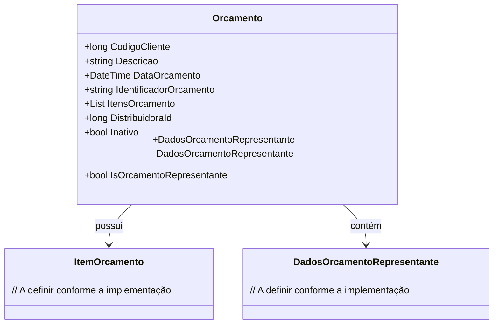

# Orcamento
**Namespace**: IsthmusWinthor.Dominio.POCO.Orcamentos  
**Nome do Arquivo**: Orcamento.cs

## Visão Geral e Responsabilidade
A classe `Orcamento` representa um orçamento associado a um cliente, permitindo a gestão de informações relacionadas ao pedido de produtos ou serviços. Esta classe é responsável por manter a integridade dos dados do orçamento, como identificação única, data de emissão e itens que compõem o orçamento, além de vincular informações sobre distribuidores e representantes. O objetivo principal é garantir que todos os dados necessários para a criação e manutenção do orçamento sejam adequadamente armazenados e acessíveis para processamento posterior.

## Métodos de Negócio
- **Título**: IsOrcamentoRepresentante (Propriedade)
  - **Objetivo**: Indicar se o orçamento está associado a um representante, determinando o comportamento de algumas operações que podem depender dessa informação.
  - **Comportamento**: A propriedade verifica se `DadosOrcamentoRepresentante` é diferente de null. Se for, retorna true, caso contrário, retorna false. Isso é útil, por exemplo, ao decidir se um orçamento deve ser tratado de maneira diferente em uma interface ou ao aplicar regras específicas de validação.
  - **Retorno**: Retorna um valor booleano que indica a presença de dados do representante no orçamento.

## Propriedades Calculadas e de Validação
- **IsOrcamentoRepresentante**: Esta propriedade calcula o estado do objeto `Orcamento` em relação a um representante mencionando que a presença de `DadosOrcamentoRepresentante` é um sinal de que o orçamento está relacionado a um representante. Isso impacta nas funcionalidades que podem ser fornecidas ao usuário, permitindo ou restringindo certas operações baseadas nessa informação.

## Navigations Property
- **DadosOrcamentoRepresentante**: [DadosOrcamentoRepresentante](DadosOrcamentoRepresentante.md)

## Tipos Auxiliares e Dependências
- Nenhum enumerador ou classe estática/habilitada foi identificada como dependência na classe `Orcamento`.

## Diagrama de Relacionamentos

Essa documentação fornece uma visão clara sobre a responsabilidade da classe `Orcamento` dentro do domínio de orçamentos, suas funcionalidades e as relações que mantém com outros componentes do sistema.
---
Gerada em 29/12/2025 21:45:51
