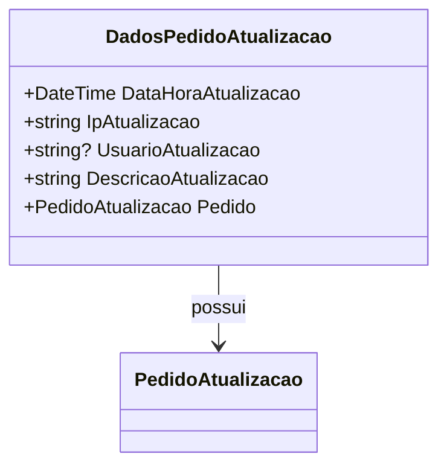

# DadosPedidoAtualizacao

**Namespace**: IsthmusWinthor.Dominio.POCO.Pedidos  
**Nome do Arquivo**: DadosPedidoAtualizacao.cs  

## Visão Geral e Responsabilidade
A classe `DadosPedidoAtualizacao` representa as informações necessárias para atualizar um pedido em um sistema de pedidos. Ela encapsula detalhes sobre a ação de atualização, como a data e hora da atualização, o usuário que realizou a ação, e uma descrição do que foi atualizado. Essa classe resolve o problema de manter um registro auditável das atualizações em pedidos, permitindo que o sistema rastreie alterações e identifique quem realizou cada ação.

## Métodos de Negócio

### Título: Equals (public override)
**Objetivo**: Garante que duas instâncias de `DadosPedidoAtualizacao` sejam consideradas equivalentes se elas se referirem ao mesmo pedido.  
**Comportamento**: 
1. Verifica se o objeto passado é do tipo `DadosPedidoAtualizacao`.
2. Compara o objeto atual com o outro através do pedido.
3. Retorna `true` se eles referem ao mesmo pedido, caso contrário, retorna `false`.  
**Retorno**: Retorna um valor booleano representando se os pedidos são equivalentes.

### Título: GetHashCode (public override)
**Objetivo**: Assegura que a classe possa ser usada em coleções que requerem um código hash único, como `HashSet`.  
**Comportamento**: 
1. Combina o código hash do `Pedido` para gerar um código hash único para a instância atual.
2. Retorna um inteiro que representa o código hash da instância.  
**Retorno**: Retorna um inteiro que representa o código hash calculado.

## Propriedades Calculadas e de Validação
Não há propriedades com lógica no `get` ou validação no `set`.

## Navigations Property
- [PedidoAtualizacao](PedidoAtualizacao.md): Representa o pedido específico que está sendo atualizado.

## Tipos Auxiliares e Dependências
- N/A: Não existem enums ou classes estáticas/auxiliares utilizados na classe.

## Diagrama de Relacionamentos

---
Gerada em 29/12/2025 21:46:03
