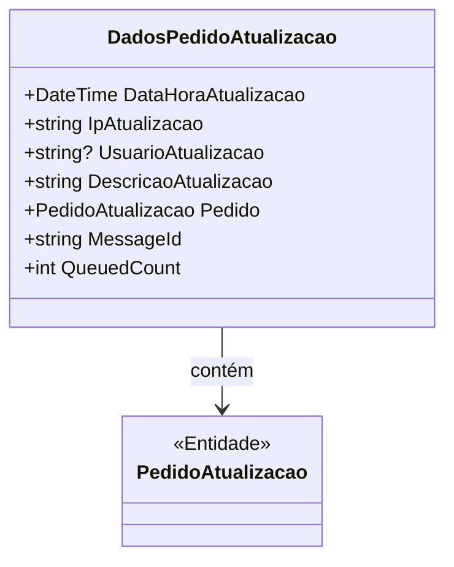

# DadosPedidoAtualizacao

**Namespace**: IsthmusWinthor.Dominio.POCO.Pedidos  
**Nome do Arquivo**: DadosPedidoAtualizacao.cs  

## Visão Geral e Responsabilidade
A classe `DadosPedidoAtualizacao` é responsável por encapsular as informações relacionadas a uma atualização de pedido dentro do sistema. Esse modelo faz parte do fluxo de mensagens, permitindo que alterações em pedidos sejam rastreadas com detalhes sobre o que foi atualizado, por quem e quando. A principal regra de negócio que esta classe aplica é garantir que cada atualização tenha informações contextuais que ajudem em auditoria e rastreamento de ações no sistema.

## Métodos de Negócio

### Título: Equals (public)
- **Objetivo**: Garante que duas instâncias de `DadosPedidoAtualizacao` são consideradas iguais se o pedido associado a elas for o mesmo.
- **Comportamento**: 
  1. Verifica se o objeto passado como parâmetro é do tipo `DadosPedidoAtualizacao`.
  2. Compara a propriedade `Pedido` da instância atual com a do objeto passado para determinar se são iguais.
- **Retorno**: Retorna `true` se os pedidos forem iguais, caso contrário, retorna `false`.

### Título: GetHashCode (public)
- **Objetivo**: Fornece um código hash para a instância, essencial para operações em estruturas de dados que utilizam hashing, como dicionários.
- **Comportamento**:
  1. Utiliza `HashCode.Combine` para gerar um código hash baseado na propriedade `Pedido`.
- **Retorno**: Um valor inteiro que representa o código hash do pedido associado.

## Propriedades Calculadas e de Validação

### Propriedades com Lógica de Validação:
- **MessageId**: Retorna o identificador do pedido como uma string. Esta propriedade é importante para identificar de forma única cada mensagem relacionada ao pedido.
  - **Regra**: A transformação da ID do pedido para string garante que a mensagem seja rastreável e facilmente identificável.

### Propiedades de Navegação
- **Pedido**: 
  - Tipo: `PedidoAtualizacao`
  - Link Presumido: `[PedidoAtualizacao](PedidoAtualizacao.md)`

## Tipos Auxiliares e Dependências
- Nenhum enumerador ou classe estática externa é utilizada diretamente nesta classe, mas ela depende da classe `PedidoAtualizacao`, a qual pode ter suas próprias regras de domínio.

## Diagrama de Relacionamentos

Esta documentação fornece uma compreensão clara sobre a classe `DadosPedidoAtualizacao`, focando em suas responsabilidades de domínio e como se integra aos processos do sistema em termos de auditoria e rastreamento de atualizações de pedidos.
