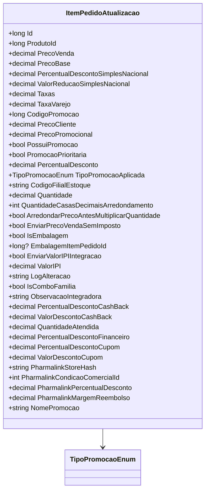

# ItemPedidoAtualizacao
**Namespace**: IsthmusWinthor.Dominio.POCO.Pedidos  
**Nome do Arquivo**: ItemPedidoAtualizacao.cs  

## Visão Geral e Responsabilidade
A classe `ItemPedidoAtualizacao` representa um item em um pedido dentro do sistema de gestão de vendas, encapsulando todas as informações relevantes sobre o item e suas propriedades econômicas. O objetivo principal dessa classe é facilitar a manipulação e atualização dos dados dos itens de um pedido, assegurando que as regras de negócios relacionadas a preços, descontos e promoções sejam corretamente aplicadas e validadas, promovendo a integridade dos dados durante o processo de vendas.

## Métodos de Negócio

### `Equals` (override)
- **Objetivo**: Garantir que dois objetos `ItemPedidoAtualizacao` sejam considerados iguais se todos os seus atributos corresponderem. Essa regra é fundamental para a comparação e unicidade de itens dentro de um pedido.
  
- **Comportamento**:
  1. Verifica se o objeto passado como parâmetro é do tipo `ItemPedidoAtualizacao`.
  2. Compara cada propriedade do objeto atual com o objeto passado, retornando verdadeiro apenas se todos os valores forem iguais.

- **Retorno**: Um valor booleano (`true` ou `false`) indicando se os dois objetos são equivalentes.

### `GetHashCode` (override)
- **Objetivo**: Gerar um código hash único para o objeto `ItemPedidoAtualizacao`, com base em suas propriedades. Essa regra é essencial para a utilização correta em coleções que dependem de hashing, como conjuntos ou dicionários.
  
- **Comportamento**:
  1. Cria um novo `HashCode`.
  2. Adiciona cada propriedade do objeto ao hash.
  3. Retorna o código hash gerado.

- **Retorno**: Um valor inteiro representando o código hash do objeto.

## Propriedades Calculadas e de Validação
- Propriedades que requerem lógica de validação ou cálculo não foram identificadas no código fornecido. A maioria das propriedades parece ser de dados diretos.

## Navigation Properties
- Nenhuma navegação para outras classes complexas do domínio foi identificada no código.

## Tipos Auxiliares e Dependências
- **Enumerações**:
  - `[TipoPromocaoEnum](TipoPromocaoEnum.md)`

## Diagrama de Relacionamentos

