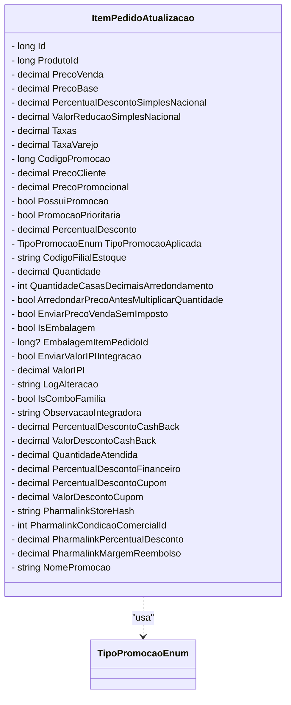

# ItemPedidoAtualizacao
**Namespace**: IsthmusWinthor.Dominio.POCO.Pedidos  
**Nome do Arquivo**: ItemPedidoAtualizacao.cs  

## Visão Geral e Responsabilidade
A classe `ItemPedidoAtualizacao` representa um item de pedido que pode passar por atualizações em um sistema de gestão de pedidos. Sua finalidade é encapsular todas as informações relevantes sobre os produtos em um pedido, como preços, descontos, taxas e outras características que afetam a venda e a valorização dos produtos. A classe é responsável por garantir a integridade dos dados do item e aplicar regras de negócio associadas ao cálculo de preços e descontos.

## Métodos de Negócio
### Equals (public override)
- **Objetivo**: Garante que a comparação entre dois itens de pedido considere todas as propriedades relevantes, permitindo determinar se dois itens são equivalentes em termos de conteúdo.
- **Comportamento**: O método compara a instância atual da classe com outro objeto `ItemPedidoAtualizacao`. Para que os itens sejam considerados iguais, todas as propriedades devem ser idênticas; se qualquer diferença for encontrada, o método retorna false.
- **Retorno**: Retorna um valor booleano que indica se os dois objetos são idênticos.

### GetHashCode (public override)
- **Objetivo**: Garante que a classe funcione corretamente em coleções baseadas em hash (como `Dictionary` ou `HashSet`) ao gerar um código hash único para a combinação de todas as propriedades relevantes.
- **Comportamento**: O método gera um código de hash usando todas as propriedades do objeto. Isso assegura que objetos iguais tenham o mesmo código hash, o que é crucial para a correta manipulação em coleções hash.
- **Retorno**: Retorna um inteiro que representa o código de hash para o objeto.

## Propriedades Calculadas e de Validação
Nenhuma propriedade calculada ou de validação foi identificada diretamente no `get` ou `set`, pois as propriedades se comportam como anêmicas.

## Navigations Property
Nenhuma propriedade que funcione como uma Navegação para classes complexas do domínio foi identificada nesta classe.

## Tipos Auxiliares e Dependências
- **Enumeradores**:
  - [TipoPromocaoEnum](TipoPromocaoEnum.md) - Utilizado na propriedade `TipoPromocaoAplicada`.

## Diagrama de Relacionamentos

---
Gerada em 29/12/2025 21:46:23
