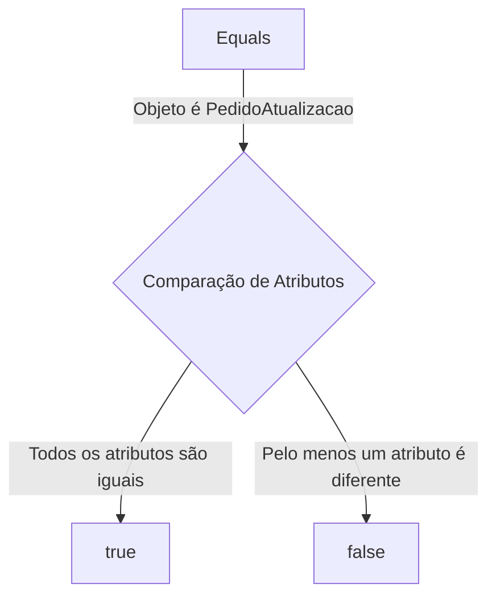
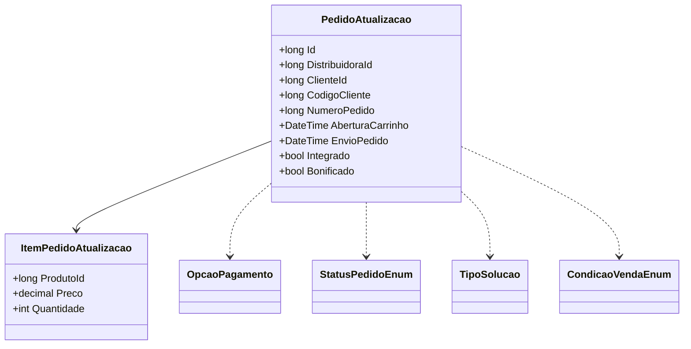

# PedidoAtualizacao
- **Namespace**: IsthmusWinthor.Dominio.POCO.Pedidos
- **Nome do Arquivo**: PedidoAtualizacao.cs

## Visão Geral e Responsabilidade
A classe `PedidoAtualizacao` representa as atualizações de pedidos dentro do sistema, sendo responsável por gerenciar as informações relacionadas aos pedidos feitos por clientes. Ela abrange diversos detalhes do pedido, incluindo dados do cliente, itens do pedido, métodos de pagamento, e status do pedido. Essa classe ajuda a garantir que todos os dados pertinentes ao pedido sejam processados corretamente, minimizando erros e melhorando a integridade de dados durante a atualização dos pedidos.

## Métodos de Negócio

### Equals: `public override bool Equals(object obj)`
- **Objetivo**: Garantir a integridade e a equivalência dos dados do pedido durante as operações de comparação.
- **Comportamento**:
  1. Verifica se o objeto passado é do tipo `PedidoAtualizacao`.
  2. Compara todos os atributos relevantes da classe, incluindo identificadores, detalhes do pedido e status.
  3. Retorna `true` se todos os atributos correspondem ao objeto comparado; caso contrário, retorna `false`.
- **Retorno**: Retorna um valor booleano que indica se os dois objetos `PedidoAtualizacao` são equivalentes.

### GetHashCode: `public override int GetHashCode()`
- **Objetivo**: Fornecer um código hash consistente para a instância da classe, essencial para operações em coleções como hash tables.
- **Comportamento**:
  1. Inicializa um novo objeto `HashCode`.
  2. Adiciona cada atributo relevante da classe à instância do hash.
  3. Retorna o código hash gerado.
- **Retorno**: Um valor inteiro representando o código hash da instância do pedido.

## Propriedades Calculadas e de Validação
N/A (A classe não contém propriedades com lógica de cálculo ou validação nas propriedades `get` ou `set`)

## Navigations Property
- `ItensPedido`: Representa a lista de itens incluídos no pedido, que é uma classe complexa do domínio. 
  - [ItemPedidoAtualizacao](ItemPedidoAtualizacao.md)

## Tipos Auxiliares e Dependências
- Enumeradores:
  - [OpcaoPagamento](OpcaoPagamento.md)
  - [StatusPedidoEnum](StatusPedidoEnum.md)
  - [TipoSolucao](TipoSolucao.md)
  - [CondicaoVendaEnum](CondicaoVendaEnum.md)

## Diagrama de Relacionamentos

Esta documentação fornece um panorama detalhado da classe `PedidoAtualizacao`, facilitando a compreensão das regras de negócio associadas e como a integridade dos dados é mantida no sistema.
