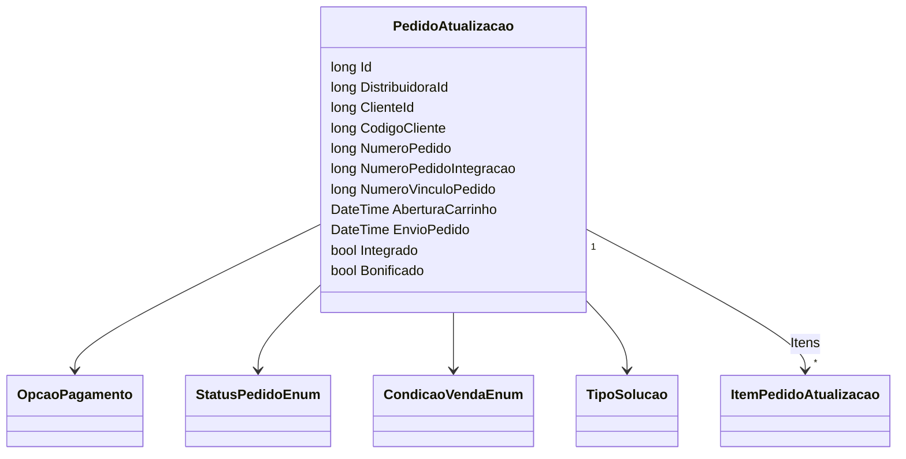

# PedidoAtualizacao
**Namespace**: IsthmusWinthor.Dominio.POCO.Pedidos  
**Nome do Arquivo**: PedidoAtualizacao.cs  

## Visão Geral e Responsabilidade
A classe `PedidoAtualizacao` representa uma entidade no domínio relacionada ao gerenciamento de pedidos de atualização no sistema. Ela é responsável por armazenar e manipular as informações de um pedido, incluindo dados como identificadores, datas de abertura e envio, opções de pagamento, itens do pedido, e status do pedido. O principal problema de negócio que esta classe resolve é a necessidade de manter o estado e as informações essenciais de um pedido em um contexto de atualização, garantindo a integridade dos dados e facilitando a integração com outros sistemas.

## Métodos de Negócio

### Método: Equals (override)
- **Objetivo**: Garante que duas instâncias da classe `PedidoAtualizacao` sejam consideradas iguais se todos os seus campos relevantes forem iguais.
- **Comportamento**: O método compara todos os atributos importantes da classe, incluindo listas de itens, verificando não apenas a contagem, mas também se cada item existe na outra lista. O método retorna verdadeiro se todos os atributos coincidem e falso caso contrário.
- **Retorno**: Retorna um valor booleano (`true` ou `false`) que indica se as duas instâncias são iguais.

Removido do método `Equals` explicações sobre estruturas de controle, pois a lógica segue uma comparação simples para cada propriedade.

### Método: GetHashCode (override)
- **Objetivo**: Fornece um código hash único para a classe `PedidoAtualizacao`, que é utilizado em coleções que requerem hashing, como conjuntos e dicionários.
- **Comportamento**: O método utiliza o `HashCode` da biblioteca C# para adicionar todos os atributos da classe ao hash, garantindo que instâncias que são consideradas iguais também tenham o mesmo código hash.
- **Retorno**: Retorna um inteiro que representa o código hash da instância.

## Propriedades Calculadas e de Validação
N/A - Todas as propriedades diretamente representam dados sem lógica de cálculo ou validação.

## Navigations Property
- Itens do pedido: `List<ItemPedidoAtualizacao> ItensPedido`
  - Referência: [ItemPedidoAtualizacao](ItemPedidoAtualizacao.md)

## Tipos Auxiliares e Dependências
- **Enumeradores**:
  - [OpcaoPagamento](OpcaoPagamento.md)
  - [StatusPedidoEnum](StatusPedidoEnum.md)
  - [CondicaoVendaEnum](CondicaoVendaEnum.md)
  - [TipoSolucao](TipoSolucao.md)

## Diagrama de Relacionamentos

A documentação apresentada acima proporciona uma visão clara e estruturada da classe `PedidoAtualizacao`, destacando suas responsabilidades, métodos e relações com outros elementos do sistema, permitindo uma compreensão efetiva da lógica de negócios que sustenta a classe.
---
Gerada em 29/12/2025 21:46:36
