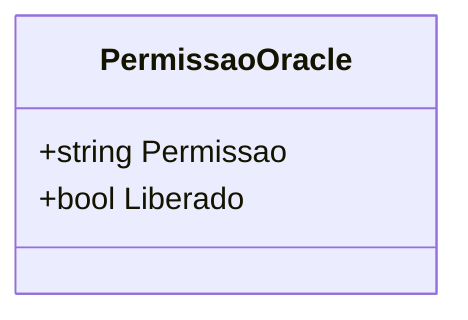

# PermissaoOracle
**Namespace**: IsthmusWinthor.Dominio.POCO  
**Nome do Arquivo**: PermissaoOracle.cs  

PermissaoOracle é uma classe que atua como um objeto de transferência de dados (DTO). Sua principal finalidade é transportar informações relacionadas a permissões dentro do sistema, especificamente se uma determinada permissão está liberada ou não. 

### Propriedades

- **Permissao**: A representação textual da permissão.
- **Liberado**: Um valor booleano que indica se a permissão está liberada.

### Tipos Auxiliares e Dependências

Não existem tipos auxiliares, enumeradores ou dependências específicas utilizados por esta classe. 

### Diagrama de Relacionamentos

