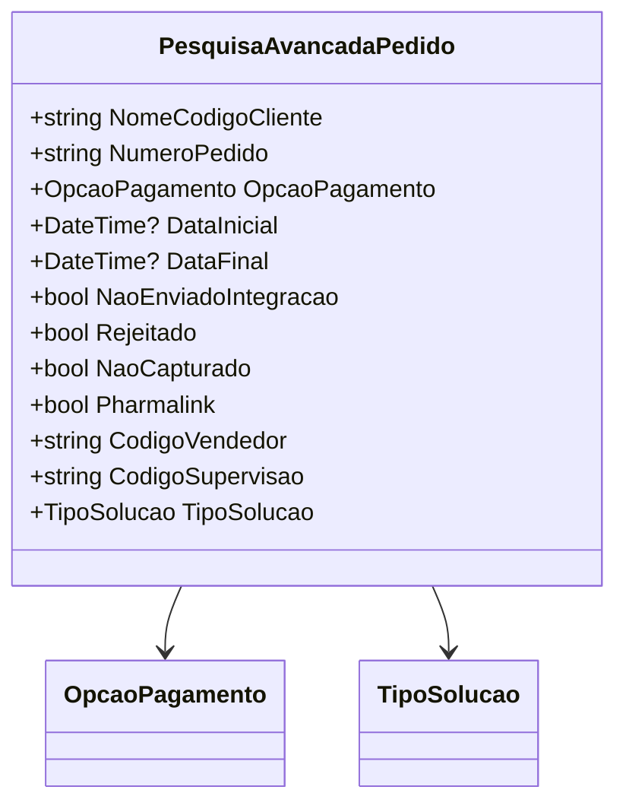

# PesquisaAvancadaPedido
**Namespace**: IsthmusWinthor.Dominio.POCO  
**Nome do Arquivo**: PesquisaAvancadaPedido.cs  

## Visão Geral e Responsabilidade
A classe `PesquisaAvancadaPedido` atua como um modelo de consulta sofisticada para pedidos dentro do sistema. Ela suporta a filtragem de pedidos com base em diversos critérios, permitindo que os usuários executem pesquisas específicas conforme suas necessidades. Essa classe é fundamental para a extração de dados relevantes e a análise de pedidos, facilitando a tomada de decisões e a gestão de vendas.

## Métodos de Negócio
A classe `PesquisaAvancadaPedido` não possui métodos de negócio implementados, uma vez que se trata de um objeto centrado em dados (DTO) que encapsula informações para transporte, sem lógica de negócio própria.

## Propriedades Calculadas e de Validação
A classe não possui propriedades que contenham lógica de cálculo ou validações em seus getters e setters, já que todas as propriedades são simples, armazenando diretamente os dados.

## Navigation Property
A classe contém as seguintes propriedades que são classes complexas do domínio:
- `OpcaoPagamento`: [OpcaoPagamento](OpcaoPagamento.md)
- `TipoSolucao`: [TipoSolucao](TipoSolucao.md)

## Tipos Auxiliares e Dependências
Os seguintes tipos auxiliares e enumeradores são utilizados pela classe:
- `OpcaoPagamento`: [OpcaoPagamento](OpcaoPagamento.md)
- `TipoSolucao`: [TipoSolucao](TipoSolucao.md)

## Diagrama de Relacionamentos

