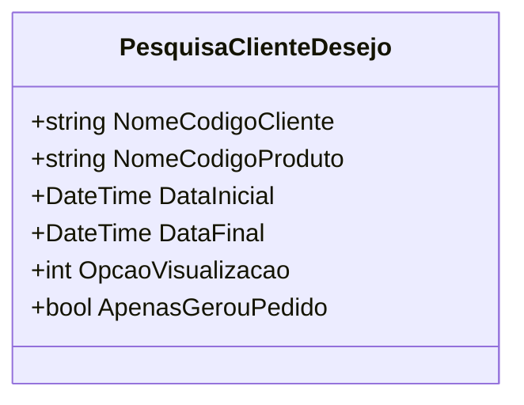

# PesquisaClienteDesejo
**Namespace**: IsthmusWinthor.Dominio.POCO  
**Nome do Arquivo**: PesquisaClienteDesejo.cs  

Essa classe atua como um Data Transfer Object (DTO) para transportar dados relativos à pesquisa de desejos de clientes em um sistema corporativo. 

### Observações Gerais
Esta classe possui propriedades anêmicas destinadas ao armazenamento de informações que serão utilizadas em consultas, mas não contém lógica de negócio ou validações. Portanto, a documentação estará focada em descrever suas propriedades. 

### Propriedades
- **NomeCodigoCliente**: Representa o código ou nome do cliente que está sendo pesquisado.
- **NomeCodigoProduto**: Representa o código ou nome do produto relacionado à pesquisa.
- **DataInicial**: Define a data de início da pesquisa, essencial para delimitar o intervalo de registros a serem consultados.
- **DataFinal**: Define a data de fim da pesquisa, formando assim um intervalo junto com a `DataInicial`.
- **OpcaoVisualizacao**: Indica como os resultados da pesquisa devem ser visualizados, permitindo ao sistema adaptar a apresentação dos dados com base na preferência do usuário.
- **ApenasGerouPedido**: Um booleano que indica se a pesquisa deve filtrar apenas clientes que geraram pedidos, ajudando na segmentação de informações relevantes.

### Tipos Auxiliares e Dependências
Esta classe não possui dependências complexas ou enumeradores utilizados que necessitem de documentação adicional.

### Diagrama de Relacionamentos

Essa documentação fornece uma visão clara e objetiva sobre a classe `PesquisaClienteDesejo`, seus propósitos e funcionalidade no contexto do sistema.
---
Gerada em 29/12/2025 21:37:37
